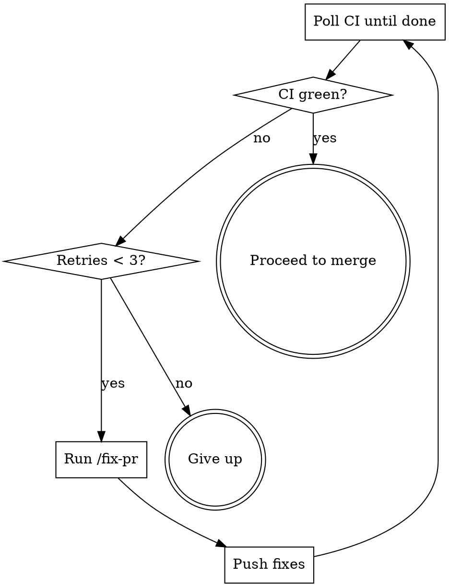

# Plan Review

Execute an implementation plan end-to-end: implement, review, fix CI, and merge.

## Step 1: Execute the Plan

Read the plan file and implement it. The plan specifies which skill(s) to use.

**Rules:**
- Tests must be strong enough to catch regressions
- Do not modify tests to make them pass
- Test failures must be reported

## Step 2: Review Implementation

Invoke `/review-implementation` to check code quality. Fix any Critical or Important issues before proceeding.

## Step 3: Push and Create PR

```bash
BRANCH=$(git branch --show-current)
git push origin $BRANCH
```

If no PR exists for this branch, create one:

```bash
gh pr create --title "<descriptive title>" --body "$(cat <<'EOF'
## Summary
<what was implemented>

Closes #<issue> (if applicable)
EOF
)"
```

Capture the PR number:

```bash
PR=$(gh pr view --json number --jq .number)
```

## Step 4: Request Copilot Review

```bash
REPO=$(gh repo view --json nameWithOwner --jq .nameWithOwner)
gh api repos/$REPO/pulls/$PR/requested_reviewers \
  --method POST -f "reviewers[]=copilot-pull-request-reviewer"
```

## Step 5: Fix Loop (max 3 retries)



For each iteration:

1. **Wait for CI** (poll every 30s, up to 15 min):
   ```bash
   REPO=$(gh repo view --json nameWithOwner --jq .nameWithOwner)
   for i in $(seq 1 30); do
       sleep 30
       HEAD_SHA=$(gh api repos/$REPO/pulls/$PR | python3 -c "import sys,json; print(json.load(sys.stdin)['head']['sha'])")
       STATUS=$(gh api repos/$REPO/commits/$HEAD_SHA/check-runs | python3 -c "
   import sys,json
   runs = json.load(sys.stdin)['check_runs']
   failed = [r['name'] for r in runs if r.get('conclusion') not in ('success', 'skipped', None)]
   pending = [r['name'] for r in runs if r.get('conclusion') is None and r['status'] != 'completed']
   if pending:
       print('PENDING')
   elif failed:
       print('FAILED')
   else:
       print('GREEN')
   ")
       if [ "$STATUS" != "PENDING" ]; then break; fi
   done
   ```

   - `GREEN` → proceed to merge
   - `FAILED` → run `/fix-pr`, push, increment retry
   - Still `PENDING` after 15 min → treat as `FAILED`

2. **Invoke `/fix-pr`** to address review comments, CI failures, and coverage gaps.

3. **Push fixes:**
   ```bash
   git push
   ```

**After 3 failed retries:** stop and report. Leave PR open for manual intervention.

## Step 6: Merge

```bash
gh pr merge $PR --squash --delete-branch --auto
```

Wait for auto-merge to land:
```bash
for i in $(seq 1 20); do
    sleep 15
    STATE=$(gh pr view $PR --json state --jq .state)
    if [ "$STATE" = "MERGED" ] || [ "$STATE" = "CLOSED" ]; then break; fi
done
```

Report final status: merged, failed, or left open.

## Constants

| Name | Value |
|------|-------|
| `MAX_RETRIES` | 3 |
| `CI_POLL_INTERVAL` | 30s |
| `CI_POLL_MAX` | 15 min |
| `MERGE_POLL_INTERVAL` | 15s |
| `MERGE_POLL_MAX` | 5 min |
