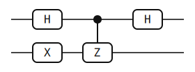
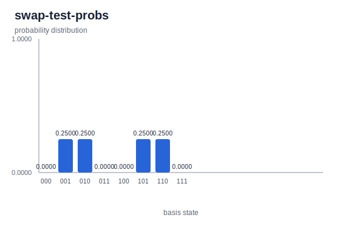

# Ancilla Protocols

> Two short circuits — the Hadamard test and the swap test — both follow the same ancilla-plus-controlled-\\( U \\) recipe, and both encode the answer in a single ancilla marginal.

## Background

The Hadamard test and the swap test share a single template. Put one ancilla
qubit in \\( |+\rangle \\), apply a unitary controlled by that ancilla,
Hadamard the ancilla again, and measure it. Because the controlled unitary
entangles the phase of \\( U \\) with the ancilla and the final Hadamard
converts that phase into a computational-basis bit, the ancilla marginal
encodes a specific matrix element or overlap. Two instances of the template
give two canonical subroutines.

The Hadamard test estimates \\( \mathrm{Re}\,\langle\psi|U|\psi\rangle \\) for
a given unitary \\( U \\) and state \\( |\psi\rangle \\); prepending an
\\( S \\) gate to the ancilla swaps the real part for the imaginary part. It
appears as the inner loop of many variational eigensolvers, where the
quantity being estimated is \\( \langle\psi|H|\psi\rangle \\) for a
Hamiltonian term \\( H \\) decomposed into unitaries.

The swap test specializes the template with \\( U = \mathrm{SWAP}_{AB} \\)
acting on two copies of prepared states \\( |\phi\rangle, |\psi\rangle \\)
and returns the overlap \\( |\langle\phi|\psi\rangle|^2 \\). It is the
standard fidelity estimator and a useful proxy for several classical-shadow
protocols.

There is a tight connection to [Phase Estimation](./phase-estimation.md):
the Hadamard test is precisely one-bit phase estimation on \\( U \\)
restricted to an input state \\( |\psi\rangle \\). When \\( |\psi\rangle \\)
happens to be an eigenstate whose eigenphase is dyadic, the two circuits
coincide gate-for-gate.

Hadamard test: Nielsen and Chuang Exercise 5.26[^nc]; swap test:
Buhrman, Cleve, Watrous, and de Wolf[^bcwd].

## The math

Derive the Hadamard test first. Start with ancilla \\( |0\rangle \\) and
system \\( |\psi\rangle \\), then apply \\( H \\) to the ancilla:

$$ |0\rangle|\psi\rangle \;\xrightarrow{H_0}\; \tfrac{1}{\sqrt{2}}(|0\rangle + |1\rangle) \otimes |\psi\rangle. $$

The controlled-\\( U \\) leaves the \\( |0\rangle \\) branch alone and sends
the \\( |1\rangle \\) branch to \\( |1\rangle \otimes U|\psi\rangle \\):

$$ \tfrac{1}{\sqrt{2}}\bigl(|0\rangle|\psi\rangle + |1\rangle\,U|\psi\rangle\bigr). $$

A second Hadamard on the ancilla expands this to

$$ \tfrac{1}{2}\Bigl(|0\rangle(|\psi\rangle + U|\psi\rangle) + |1\rangle(|\psi\rangle - U|\psi\rangle)\Bigr). $$

The ancilla-\\( 0 \\) marginal probability is therefore

$$ P(0) \;=\; \tfrac{1}{4}\bigl\||\psi\rangle + U|\psi\rangle\bigr\|^2 \;=\; \tfrac{1}{2}\bigl(1 + \mathrm{Re}\,\langle\psi|U|\psi\rangle\bigr), $$

and \\( P(1) = \tfrac{1}{2}(1 - \mathrm{Re}\,\langle\psi|U|\psi\rangle) \\).
The difference \\( P(0) - P(1) = \mathrm{Re}\,\langle\psi|U|\psi\rangle \\)
is the observable that sampling the ancilla estimates directly. For the
imaginary part, replace the first \\( H \\) on the ancilla by \\( SH \\):
this prepares \\( (|0\rangle + i|1\rangle)/\sqrt{2} \\) instead, and the
same derivation now gives
\\( P(0) - P(1) = \mathrm{Im}\,\langle\psi|U|\psi\rangle \\).

The swap test is the specialization with two registers and
\\( U = \mathrm{SWAP}_{AB} \\). Prepare registers \\( A \\) and \\( B \\) in
\\( |\phi\rangle \\) and \\( |\psi\rangle \\); prepare the ancilla in
\\( |+\rangle \\); apply controlled-SWAP; apply \\( H \\) to the ancilla.
The same identity gives

$$ P(0) \;=\; \tfrac{1}{2}\bigl(1 + \mathrm{Re}\,\langle\phi|\langle\psi|\,\mathrm{SWAP}\,|\phi\rangle|\psi\rangle\bigr). $$

The SWAP matrix element evaluates as
\\( \langle\phi|\langle\psi|\,\mathrm{SWAP}\,|\phi\rangle|\psi\rangle = \langle\phi|\psi\rangle\langle\psi|\phi\rangle = |\langle\phi|\psi\rangle|^2 \\),
which is real and non-negative, so the real-part wrapper is redundant and

$$ P(\text{ancilla}=0) \;=\; \tfrac{1}{2}\bigl(1 + |\langle\phi|\psi\rangle|^2\bigr). $$

Sampling \\( P(\text{ancilla}=0) \\) and inverting gives the squared overlap.

**Ancilla marginals.** When the system register holds more than one qubit,
the full measurement distribution has structure beyond the ancilla bit. What
the protocol promises is a statement about the ancilla *marginal* — the
distribution obtained by summing out the system register. In the swap-test
example below, the 8-dimensional probability array has four equal-weight
entries of \\( 0.25 \\), yet the ancilla marginal cleanly reports
\\( P(0) = 1/2 \\). In general, one computes the ancilla marginal from the
full probability vector by summing over all basis indices whose ancilla bit
matches the desired outcome.

## The circuits

### Hadamard test Z



Four elements on two qubits. Qubit 0 is the ancilla; qubit 1 carries the
input state. The circuit JSON follows the
[Circuit JSON Conventions](../conventions.md):

```json
{
  "num_qubits": 2,
  "elements": [
    {"type": "gate", "gate": "X", "targets": [1]},
    {"type": "gate", "gate": "H", "targets": [0]},
    {"type": "gate", "gate": "Z", "targets": [1], "controls": [0]},
    {"type": "gate", "gate": "H", "targets": [0]}
  ]
}
```

[Full Hadamard-test JSON](./generated/circuits/hadamard-test-z.json). The
gates map directly onto the template: `X` on q1 prepares the input
\\( |\psi\rangle = |1\rangle \\); the first `H` on q0 puts the ancilla in
\\( |+\rangle \\); the controlled `Z` is the controlled-\\( U \\) step with
\\( U = Z \\); the second `H` on q0 is the readout.

These are exactly the four gates of the [Phase Estimation](./phase-estimation.md)
example, and that coincidence is the point. One-bit phase estimation on
\\( U = Z \\) with eigenstate \\( |1\rangle \\) reads off the eigenphase
\\( \varphi = 1/2 \\). The Hadamard test with the same inputs reads off
\\( \mathrm{Re}\,\langle 1|Z|1\rangle = -1 \\). Both read the ancilla and
get the bit \\( 1 \\). The circuit is identical — what differs is the
interpretation.

### Swap test


Four elements on three qubits. Qubit 0 is the ancilla; qubit 1 is register
\\( A \\); qubit 2 is register \\( B \\). JSON:

```json
{
  "num_qubits": 3,
  "elements": [
    {"type": "gate", "gate": "X", "targets": [2]},
    {"type": "gate", "gate": "H", "targets": [0]},
    {"type": "gate", "gate": "SWAP", "targets": [1, 2], "controls": [0]},
    {"type": "gate", "gate": "H", "targets": [0]}
  ]
}
```

[Full swap-test JSON](./generated/circuits/swap-test.json). The `X` on q2
prepares \\( |\psi\rangle = |1\rangle \\) on register \\( B \\); register
\\( A \\) stays in \\( |\phi\rangle = |0\rangle \\). The first `H` on q0
places the ancilla in \\( |+\rangle \\); the controlled `SWAP` swaps
\\( A \\) and \\( B \\) when the ancilla is \\( |1\rangle \\); the final
`H` reads out.

> **Bit ordering callout.** In yao-rs, qubit 0 is the *most* significant bit
> of the index. The 8-entry probability array below indexes basis states
> \\( |q_0 q_1 q_2\rangle \\) with \\( q_0 \\) — the ancilla — at the left.
> Indices \\( 0, 1, 2, 3 \\) are the outcomes with ancilla \\( = 0 \\);
> indices \\( 4, 5, 6, 7 \\) are the outcomes with ancilla \\( = 1 \\). See
> [bit ordering](../conventions.md#bit-ordering).

## Running it

**Quick run** — download the circuit JSONs
([Hadamard test](./generated/circuits/hadamard-test-z.json),
[swap test](./generated/circuits/swap-test.json)) and simulate each:

```bash
yao simulate hadamard-test-z.json | yao probs -
yao simulate swap-test.json | yao probs -
```

Expected output for Hadamard test (deterministic \\( |11\rangle \\)):

```text
{
  "locs": null,
  "num_qubits": 2,
  "probabilities": [0.0, 0.0, 0.0, 1.0000000000000004]
}
```

Expected output for swap test (four equal non-zero entries of \\( 0.25 \\)):

```text
{
  "locs": null,
  "num_qubits": 3,
  "probabilities": [
    0.0, 0.2500000000000001, 0.2500000000000001, 0.0,
    0.0, 0.2500000000000001, 0.2500000000000001, 0.0
  ]
}
```

**Regenerating this page's artifacts** from the repo root:

```bash
cargo build -p yao-cli --no-default-features
YAO_ARTIFACT_DIR=docs/src/examples/generated YAO_BIN=target/debug/yao bash examples/cli/hadamard_test_z.sh
YAO_ARTIFACT_DIR=docs/src/examples/generated YAO_BIN=target/debug/yao bash examples/cli/swap_test.sh
python3 scripts/plot_cli_results.py docs/src/examples/generated/results docs/src/examples/generated/plots
```

## Interpreting the result

### Hadamard test result


The probability array is `[0, 0, 0, 1]`: deterministic outcome
\\( |q_0 q_1\rangle = |11\rangle \\). Split by register: the ancilla
\\( q_0 = 1 \\) and the input register \\( q_1 = 1 \\) (unchanged, as the
eigenstate should be). Apply the Hadamard test identity:

$$ P(0) - P(1) \;=\; 0 - 1 \;=\; -1 \;=\; \mathrm{Re}\,\langle 1|Z|1\rangle, $$

since \\( Z|1\rangle = -|1\rangle \\). This is an eigenstate case; the
ancilla marginal is sharp.

### Swap test result



The probability array is `[0, 0.25, 0.25, 0, 0, 0.25, 0.25, 0]`. Four
non-zero entries of equal weight — not the sharp concentration the
eigenstate Hadamard test produced. Extract the ancilla marginal by summing
over indices whose top bit (qubit 0) is zero. Those indices are
\\( 0, 1, 2, 3 \\), with probabilities \\( 0, 0.25, 0.25, 0 \\), summing to

$$ P(\text{ancilla}=0) \;=\; 0.5. $$

Matching the swap-test identity:
\\( \tfrac{1}{2}(1 + |\langle 0|1\rangle|^2) = \tfrac{1}{2}(1 + 0) = 1/2 \\). ✓
The ancilla gets no information about \\( \{|\phi\rangle, |\psi\rangle\} \\)
because those states are orthogonal.

The four-entry spread in the full distribution is a statement about the
*system* register, not the ancilla. Conditioned on ancilla = 0 or ancilla =
1, the two-register marginal is an equal-weight mixture of \\( |01\rangle \\)
and \\( |10\rangle \\) — the states produced by the SWAP acting or not
acting on the distinguishable input \\( |\phi\rangle_A|\psi\rangle_B = |01\rangle \\).
The controlled-SWAP has entangled the ancilla with the register, producing
a Bell-like state across the two subsystems. The system register carries
which-way information that the ancilla marginal discards.

## Variations & next steps

- **Imaginary part.** Insert an \\( S \\) gate on the ancilla immediately
  after the first \\( H \\) to turn the Hadamard test into an estimator of
  \\( \mathrm{Im}\,\langle\psi|U|\psi\rangle \\).
- **General overlaps.** Prepare \\( |\phi\rangle \\) and \\( |\psi\rangle \\)
  on the two registers with arbitrary state-prep circuits; the swap test
  then estimates \\( |\langle\phi|\psi\rangle|^2 \\) for arbitrary prepared
  states. This is the workhorse fidelity estimator for quantum learning and
  verification.
- **Expectation values inside variational algorithms.** See
  [QAOA MaxCut](./qaoa-maxcut.md) for a problem whose objective is a sum of
  Pauli expectation values; Hadamard-test subroutines are one standard way
  to measure each term. Variational eigensolvers (issue #31) follow the
  same pattern.
- **Phase estimation connection.** See [Phase Estimation](./phase-estimation.md)
  for the one-bit QPE circuit, which on this input is gate-for-gate the
  Hadamard test.
- **Deferred.** Classical shadows estimate many overlaps at once with a
  different sampling strategy and are not in this catalogue.

## References

[^nc]: M. A. Nielsen and I. L. Chuang, *Quantum Computation and Quantum
    Information*, 10th Anniversary Edition (Cambridge University Press,
    2010), Exercise 5.26 (the Hadamard test).

[^bcwd]: H. Buhrman, R. Cleve, J. Watrous, and R. de Wolf, "Quantum
    fingerprinting", *Phys. Rev. Lett.* **87**, 167902 (2001).
