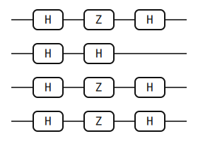

# Bernstein–Vazirani

> Recover an unknown \\( n \\)-bit string from a single oracle query — the
> cleanest textbook demonstration that quantum algorithms can beat the
> classical query lower bound.

## Background

Bernstein and Vazirani posed the following puzzle in 1993[^bv]. You are given
oracle access to a function \\( f : \{0, 1\}^n \to \{0, 1\} \\) that is
guaranteed to have the form \\( f(x) = s \cdot x \bmod 2 \\) for some fixed
but unknown bitstring \\( s \in \{0, 1\}^n \\), where
\\( s \cdot x = \sum_i s_i x_i \\) is the bitwise inner product. The goal is
to recover \\( s \\). Classically, you need \\( n \\) oracle queries — query
\\( f \\) on each standard basis vector \\( e_i \\) to read off one bit of
\\( s \\) at a time, and any adaptive strategy that uses fewer queries must
misidentify \\( s \\) on some instance. The Bernstein–Vazirani (BV) algorithm
uses *one* oracle query.

One query is the minimum possible, so BV is optimal and the classical-quantum
gap is exactly a factor of \\( n \\). Compared to Shor and HHL this is a
modest speedup, but BV is often the first concrete superpolynomial separation
one can walk through by hand: no QFT, no phase-estimation ladder, no
eigenstate preparation. All it takes is a layer of Hadamards, a layer of
single-qubit \\( Z \\) gates, and another layer of Hadamards. The construction
also scales to textbook-length for any \\( n \\), so it doubles as a stress
test for frameworks and a teaching example. Nielsen and Chuang discuss the
algorithm in §1.4.4[^nc].

## The math

The standard presentation uses a bit-XOR oracle
\\( U_f|x\rangle|y\rangle = |x\rangle|y \oplus f(x)\rangle \\) on an \\( n \\)-qubit
input register plus a one-qubit ancilla \\( y \\). A standard trick
initializes the ancilla in
\\( |-\rangle = (|0\rangle - |1\rangle)/\sqrt{2} \\). Then

$$ U_f\,|x\rangle|-\rangle \;=\; |x\rangle \otimes \tfrac{1}{\sqrt{2}}\bigl(|f(x)\rangle - |1 \oplus f(x)\rangle\bigr) \;=\; (-1)^{f(x)}\,|x\rangle|-\rangle. $$

The ancilla is unchanged; its only job was to convert the bit-flip oracle into
a *phase* oracle \\( O_f : |x\rangle \mapsto (-1)^{f(x)}|x\rangle \\) on the
input register. From here on we fold the ancilla away and work only with the
\\( n \\)-qubit input register and the phase oracle \\( O_f \\).

**Phase oracle decomposition.** Because
\\( s \cdot x \bmod 2 = \sum_i s_i x_i \bmod 2 \\) and the phase \\( -1 \\) is
multiplicative,

$$ O_f \;=\; \prod_{i : s_i = 1} Z_i. $$

Each \\( Z_i \\) is the single-qubit Pauli \\( Z = \operatorname{diag}(1, -1) \\)
acting on qubit \\( i \\); it contributes a phase
\\( (-1)^{x_i} \\) on the \\( |1\rangle \\) branch of qubit \\( i \\), so
qubits with \\( s_i = 1 \\) pick up a \\( (-1)^{s_i x_i} \\) factor and qubits
with \\( s_i = 0 \\) pick up no phase. The oracle is thus a trivial product of
single-qubit \\( Z \\) gates once the secret is known. The point of BV is that
we can *discover* the secret in one query.

**Full algorithm.** Starting from \\( |0\rangle^{\otimes n} \\) and applying
\\( H^{\otimes n} \\) creates the uniform superposition. Applying the phase
oracle attaches a sign \\( (-1)^{s \cdot x} \\) to each basis term:

$$ |0\rangle^{\otimes n} \;\xrightarrow{H^{\otimes n}}\; \frac{1}{\sqrt{2^n}}\sum_x |x\rangle \;\xrightarrow{O_f}\; \frac{1}{\sqrt{2^n}}\sum_x (-1)^{s \cdot x}\,|x\rangle. $$

A second layer of Hadamards performs the readout. The identity
\\( H^{\otimes n}|x\rangle = 2^{-n/2}\sum_y (-1)^{x \cdot y}|y\rangle \\)
turns the state into

$$ \frac{1}{2^n}\sum_{x, y} (-1)^{x \cdot (s \oplus y)}\,|y\rangle. $$

The inner sum over \\( x \\) of \\( (-1)^{x \cdot t} \\) equals \\( 2^n \\)
when \\( t = 0 \\) and zero otherwise — the orthogonality of characters of
\\( \mathbb{Z}_2^n \\). So every \\( y \neq s \\) cancels, and the double sum
collapses to

$$ \sum_y \delta_{y, s}\,|y\rangle \;=\; |s\rangle. $$

One measurement returns \\( s \\) with certainty.

**Query complexity.** One oracle call suffices because the Hadamard-wrapped
phase oracle is a Fourier-style readout. The uniform superposition broadcasts
\\( x \\) across every classical input at once; the oracle writes \\( s \\)
into the phases; the final Hadamards invert the superposition and concentrate
all amplitude on \\( |s\rangle \\). Every bit of \\( s \\) is read in
parallel.

## The circuit



Eleven elements on four qubits, for the secret \\( s = 1011 \\). The phase
oracle is \\( Z_0 Z_2 Z_3 \\): there is a \\( Z \\) on each qubit whose
secret bit is \\( 1 \\), and no \\( Z \\) on qubit 1 because \\( s_1 = 0 \\).
Reading left-to-right, the circuit has three phases:

1. \\( H^{\otimes 4} \\) — four Hadamards, one per qubit, building the
   uniform superposition from \\( |0\rangle^{\otimes 4} \\).
2. \\( Z_0 Z_2 Z_3 \\) — the phase oracle for \\( s = 1011 \\). The script
   indexes the secret string left-to-right as qubit 0 through qubit \\( n-1 \\)
   (so \\( s_0 = 1,\ s_1 = 0,\ s_2 = 1,\ s_3 = 1 \\)) and appends a \\( Z \\)
   on exactly the qubits whose secret bit is \\( 1 \\).
3. \\( H^{\otimes 4} \\) — the inverse Hadamard layer that performs the
   readout. \\( H \\) is self-inverse, so the same layer of Hadamards that
   built the superposition is the one that collapses it.

The full circuit JSON follows the
[Circuit JSON Conventions](../conventions.md):

```json
{
  "num_qubits": 4,
  "elements": [
    {"type": "gate", "gate": "H", "targets": [0]},
    {"type": "gate", "gate": "H", "targets": [1]},
    {"type": "gate", "gate": "H", "targets": [2]},
    {"type": "gate", "gate": "H", "targets": [3]},
    {"type": "gate", "gate": "Z", "targets": [0]},
    {"type": "gate", "gate": "Z", "targets": [2]},
    {"type": "gate", "gate": "Z", "targets": [3]},
    {"type": "gate", "gate": "H", "targets": [0]},
    {"type": "gate", "gate": "H", "targets": [1]},
    {"type": "gate", "gate": "H", "targets": [2]},
    {"type": "gate", "gate": "H", "targets": [3]}
  ]
}
```

[Full Bernstein–Vazirani JSON](./generated/circuits/bernstein-vazirani-1011.json).

> **Bit ordering callout.** In yao-rs, qubit 0 is the *most* significant
> bit of the probability-array index: `probabilities[k]` corresponds to
> \\( |q_0 q_1 q_2 q_3\rangle \\) with \\( q_0 \\) written at the left. The
> script's secret-string convention also treats position 0 as the leftmost
> character, so reading the measured index as a 4-bit binary string gives
> back the secret character-for-character. See
> [bit ordering](../conventions.md#bit-ordering) for the full rule.

## Running it

**Quick run** — download the
[BV-1011 circuit JSON](./generated/circuits/bernstein-vazirani-1011.json)
and simulate:

```bash
yao simulate bernstein-vazirani-1011.json | yao probs -
```

Expected output (single non-zero entry at index 11, binary `1011`):

```text
{
  "locs": null,
  "num_qubits": 4,
  "probabilities": [
    0.0, 0.0, 0.0, 0.0,
    0.0, 0.0, 0.0, 0.0,
    0.0, 0.0, 0.0, 1.0000000000000004,
    0.0, 0.0, 0.0, 0.0
  ]
}
```

**Regenerating this page's artifacts** from the repo root:

```bash
cargo build -p yao-cli --no-default-features
YAO_ARTIFACT_DIR=docs/src/examples/generated YAO_BIN=target/debug/yao bash examples/cli/bernstein_vazirani.sh 1011
python3 scripts/plot_cli_results.py docs/src/examples/generated/results docs/src/examples/generated/plots
```

## Interpreting the result


The probability array has a single non-zero entry: `probabilities[11] = 1`,
every other entry is zero. Under the qubit-0-MSB convention, index 11 is the
basis state \\( |q_0 q_1 q_2 q_3\rangle = |1011\rangle \\). Writing the index
out,

$$ 11 \;=\; 8 + 0 + 2 + 1 \;=\; q_0 \cdot 2^3 + q_1 \cdot 2^2 + q_2 \cdot 2^1 + q_3 \cdot 2^0, $$

so \\( q_0 = 1,\ q_1 = 0,\ q_2 = 1,\ q_3 = 1 \\). The four qubit values read
in order are exactly the four characters of the secret string "1011". This is
the alignment the convention buys you: the script indexes the secret
left-to-right as qubits 0 through \\( n-1 \\), and yao-rs indexes the basis
state left-to-right with qubit 0 as the MSB, so "read index 11 as a 4-bit
binary number" and "read the secret" are the same operation.

Two things are worth naming. First, the outcome is *deterministic* — one
shot, probability 1, no majority vote required. Classical algorithms need
\\( n \\) oracle queries on average to pin down the last bit; BV needs
exactly one, and the answer appears as a sharp peak in the probability
distribution. Second, the peak is concentrated because the final Hadamard
layer implements an exact Fourier inversion over \\( \mathbb{Z}_2^n \\); any
other measurement basis would scatter amplitude across multiple outcomes and
require more shots to decode.

## Variations & next steps

- **Different secrets.** Run the shell script with any bitstring of any
  length, up to the CLI's practical qubit limit:
  `bash examples/cli/bernstein_vazirani.sh 110100`. The probability should
  always concentrate on the index whose \\( n \\)-bit binary expansion
  matches the secret character-for-character.
- **Simon's algorithm** generalizes BV from a hidden linear function over
  \\( \mathbb{Z}_2 \\) to a hidden period (issue #34 tracks richer oracle
  examples). The speedup becomes exponential rather than linear.
- **Deutsch–Jozsa** solves the constant-vs-balanced decision problem with
  the same H–oracle–H scaffold in one query; conceptually the same family
  and a good companion exercise.
- Cross-links: [Grover Search](./grover-search.md) is a different
  oracle-driven algorithm that uses amplitude amplification rather than a
  Fourier-style readout, and [Entangled States](./entangled-states.md)
  covers the Hadamard-fan preparation step that underlies this algorithm's
  uniform-superposition stage.

## References

[^bv]: E. Bernstein and U. Vazirani, "Quantum complexity theory", in
    *Proc. 25th Annual ACM Symposium on Theory of Computing* (ACM, 1993),
    pp. 11–20; full version *SIAM J. Comput.* **26**, 1411 (1997).

[^nc]: M. A. Nielsen and I. L. Chuang, *Quantum Computation and Quantum
    Information*, 10th Anniversary Edition (Cambridge University Press,
    2010), §1.4.4 (the Bernstein–Vazirani algorithm).
