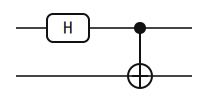
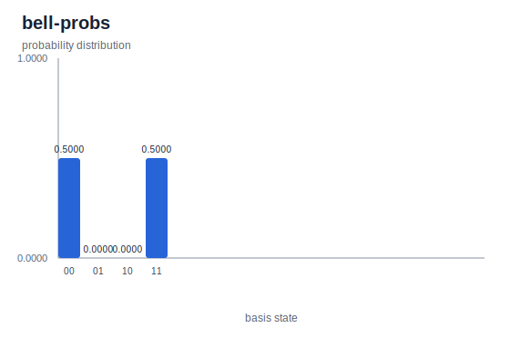
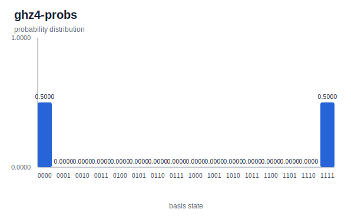

# Entangled States

> Build the Bell pair and its n-qubit cousin the GHZ state, and see why their correlations have no product-state factorization.

## Background

An n-qubit pure state \\( |\psi\rangle \\) is *separable* across a bipartition
\\( A|B \\) if it factors as \\( |\psi_A\rangle \otimes |\psi_B\rangle \\).
Otherwise it is *entangled* across that cut. A state that is entangled across
every non-trivial bipartition is called *genuinely multipartite entangled*.
Entanglement is the resource that separates quantum computing from a
probabilistic classical register: classical correlations always factor once
you condition on enough shared randomness; quantum correlations do not.

The two-qubit Bell pair \\( |\Phi^+\rangle = (|00\rangle + |11\rangle)/\sqrt{2} \\)
is the oldest worked example. Einstein, Podolsky, and Rosen used it in 1935
to argue quantum mechanics had to be incomplete[^epr]. Bell turned that
argument around in 1964 by deriving inequalities that any local-hidden-variable
theory must satisfy and that \\( |\Phi^+\rangle \\) violates[^bell64].
Greenberger, Horne, and Zeilinger generalized the argument in 1989 to three
qubits with a state that violates local realism with certainty rather than
statistically[^ghz89]. The n-qubit generalization of their state — the GHZ
state — is the natural "fan" circuit built on top of a Bell pair.

Nielsen and Chuang cover this material in §1.3.6 and §2.3[^nc].

## The math

Write \\( |0\rangle = \binom{1}{0} \\) and \\( |1\rangle = \binom{0}{1} \\).
The Hadamard and controlled-NOT matrices we need are

$$ H = \tfrac{1}{\sqrt{2}}\begin{pmatrix} 1 & 1 \\\\ 1 & -1 \end{pmatrix}, \qquad \text{CNOT}_{0 \to 1}|q_1 q_0\rangle = |q_1 \oplus q_0,\ q_0\rangle. $$

Here qubit 0 is the control and qubit 1 the target; \\( \oplus \\) is XOR.

**Step 1.** Start in \\( |00\rangle \\) and apply \\( H \\) to qubit 0:

$$ H_0|00\rangle = \tfrac{1}{\sqrt{2}}(|00\rangle + |10\rangle). $$

**Step 2.** Apply \\( \text{CNOT}_{0 \to 1} \\). It leaves \\( |00\rangle \\)
alone and sends \\( |10\rangle \mapsto |11\rangle \\):

$$ |\Phi^+\rangle \;=\; \text{CNOT}_{0 \to 1} H_0 |00\rangle \;=\; \tfrac{1}{\sqrt{2}}(|00\rangle + |11\rangle). $$

The four Bell states
\\( |\Phi^\pm\rangle = (|00\rangle \pm |11\rangle)/\sqrt{2} \\),
\\( |\Psi^\pm\rangle = (|01\rangle \pm |10\rangle)/\sqrt{2} \\)
span the two-qubit Hilbert space and are all maximally entangled across the
\\( 0|1 \\) cut. They can be reached from \\( |\Phi^+\rangle \\) by local
Pauli operations: \\( Z_0, X_0, X_0 Z_0 \\) respectively.

**No product factorization.** Suppose \\( |\Phi^+\rangle = (a|0\rangle + b|1\rangle) \otimes (c|0\rangle + d|1\rangle) \\).
Expanding, the amplitudes on \\( |00\rangle, |01\rangle, |10\rangle, |11\rangle \\)
are \\( ac, ad, bc, bd \\). Matching to \\( (1/\sqrt{2}, 0, 0, 1/\sqrt{2}) \\)
forces \\( ad = bc = 0 \\) while \\( ac = bd = 1/\sqrt{2} \\). The first pair
forces one of \\( \{a,d\} \\) and one of \\( \{b,c\} \\) to vanish; any such
choice kills one of the non-zero amplitudes. Contradiction, so no factorization
exists.

**Partial trace.** Trace qubit 1 out of
\\( \rho = |\Phi^+\rangle\langle\Phi^+| \\):

$$ \rho_0 = \operatorname{Tr}_1 \rho = \tfrac{1}{2}\bigl(|0\rangle\langle 0| + |1\rangle\langle 1|\bigr) = \tfrac{I}{2}. $$

A single qubit described by \\( I/2 \\) is maximally mixed — the observer with
access only to qubit 0 sees uniform random bits. Maximum local disorder plus
a pure global state is the signature of maximal entanglement.

**GHZ generalization.** On n qubits, apply \\( H \\) to qubit 0 and then
\\( \text{CNOT}_{0 \to k} \\) for \\( k = 1, \dots, n-1 \\). Each CNOT copies
the branch on qubit 0 onto qubit \\( k \\) in the computational basis, so

$$ |\text{GHZ}_n\rangle \;=\; \tfrac{1}{\sqrt{2}}\bigl(|0\rangle^{\otimes n} + |1\rangle^{\otimes n}\bigr). $$

Tracing out any \\( n-1 \\) qubits of \\( |\text{GHZ}_n\rangle \\) again gives
\\( I/2 \\) on the remaining qubit, so every single qubit is maximally entangled
with the rest. The same no-factorization argument as above rules out any
\\( A|B \\) product form.

## The circuit



Two elements. The circuit JSON follows the
[Circuit JSON Conventions](../conventions.md):

```json
{
  "num_qubits": 2,
  "elements": [
    {"type": "gate", "gate": "H", "targets": [0]},
    {"type": "gate", "gate": "X", "targets": [1], "controls": [0], "control_configs": [true]}
  ]
}
```

The CNOT is encoded as an `X` gate with a control on qubit 0;
`control_configs: [true]` means the control fires on \\( |1\rangle \\) (active-high).
[Full Bell circuit JSON](./generated/circuits/bell.json).


GHZ-4 reuses the same pattern with three controlled-X gates fanning out from
qubit 0:

```json
{
  "num_qubits": 4,
  "elements": [
    {"type": "gate", "gate": "H", "targets": [0]},
    {"type": "gate", "gate": "X", "targets": [1], "controls": [0], "control_configs": [true]},
    {"type": "gate", "gate": "X", "targets": [2], "controls": [0], "control_configs": [true]},
    {"type": "gate", "gate": "X", "targets": [3], "controls": [0], "control_configs": [true]}
  ]
}
```

[Full GHZ-4 circuit JSON](./generated/circuits/ghz4.json). The fan topology is
visible in the SVG above: one Hadamard, then three controls all rooted at qubit
0.

> **Bit ordering callout.** In yao-rs, qubit 0 is the *most* significant
> bit of the probability-array index: `probabilities[k]` is the probability
> of the basis state whose binary label, read with enough leading zeros to
> fill \\( n \\) bits, has \\( q_0 \\) at the left. See
> [bit ordering](../conventions.md#bit-ordering) for the full convention.

## Running it

**Quick run** (after `cargo install --path yao-cli`, so `yao` is on your PATH):

```bash
yao example bell | yao simulate - | yao probs -
```

Expected output:

```text
{
  "locs": null,
  "num_qubits": 2,
  "probabilities": [
    0.5000000000000001,
    0.0,
    0.0,
    0.5000000000000001
  ]
}
```

For GHZ-4 the pipeline is the same with `--nqubits 4`:

```bash
yao example ghz --nqubits 4 | yao simulate - | yao probs -
```

Expected output (16 entries; only indices 0 and 15 are non-zero):

```text
{
  "locs": null,
  "num_qubits": 4,
  "probabilities": [
    0.5000000000000001, 0.0, 0.0, 0.0,
    0.0, 0.0, 0.0, 0.0,
    0.0, 0.0, 0.0, 0.0,
    0.0, 0.0, 0.0, 0.5000000000000001
  ]
}
```

**Regenerating this page's artifacts** (SVG diagrams and probability plots), run from the repo root:

```bash
cargo build -p yao-cli --no-default-features
target/debug/yao example bell --json --output docs/src/examples/generated/circuits/bell.json
target/debug/yao visualize docs/src/examples/generated/circuits/bell.json --output docs/src/examples/generated/svg/bell.svg
target/debug/yao simulate docs/src/examples/generated/circuits/bell.json | target/debug/yao probs - > docs/src/examples/generated/results/bell-probs.json
target/debug/yao example ghz --nqubits 4 --json --output docs/src/examples/generated/circuits/ghz4.json
target/debug/yao visualize docs/src/examples/generated/circuits/ghz4.json --output docs/src/examples/generated/svg/ghz4.svg
target/debug/yao simulate docs/src/examples/generated/circuits/ghz4.json | target/debug/yao probs - > docs/src/examples/generated/results/ghz4-probs.json
python3 scripts/plot_cli_results.py docs/src/examples/generated/results docs/src/examples/generated/plots
```

## Interpreting the result



The Bell result is `probabilities = [0.5, 0, 0, 0.5]`. Index 0 is
\\( |00\rangle \\), index 3 is \\( |11\rangle \\); indices 1 and 2 — the
\\( |01\rangle \\) and \\( |10\rangle \\) outcomes where the two qubits
disagree — have probability zero. Measurements on the two qubits are perfectly
correlated: whichever outcome qubit 0 reports, qubit 1 reports the same bit.



GHZ-4 has `probabilities[0] = probabilities[15] = 0.5` and every one of the
fourteen middle entries is exactly zero. Under the yao-rs convention qubit 0
is the MSB, so index 15 is binary \\( 1111 \\) read as
\\( |q_0 q_1 q_2 q_3\rangle = |1111\rangle \\) — i.e. all four qubits in
\\( |1\rangle \\).
So on measurement the four qubits collapse together: all zeros or all ones, with
equal probability and no intermediate outcomes.

The non-classical content is this: the agreement is there before measurement,
not imposed by it. Any local-hidden-variable story — each qubit carries a
pre-assigned bit that the measurement reveals — must commit to a joint
distribution over the four classical bit-strings. Such distributions cannot
reproduce the full set of correlations \\( |\Phi^+\rangle \\) produces across
different measurement bases; Bell's 1964 inequality is the quantitative form of
this impossibility[^bell64], and \\( |\Phi^+\rangle \\) violates it. GHZ
sharpens the statement to an all-or-nothing contradiction[^ghz89].

## Variations & next steps

- Change `--nqubits` on `yao example ghz` to produce
  \\( |\text{GHZ}_n\rangle \\) for any \\( n \geq 2 \\).
  With \\( n = 2 \\) you recover the Bell state.
- See [Quantum Fourier Transform](./qft.md) for the superposition+phase
  pattern that underlies phase estimation, and
  [Bernstein–Vazirani](./bernstein-vazirani.md) for a single-shot algorithm
  that reads a hidden bitstring using the same H-fan structure.
- The *W state* \\( (|100\ldots 0\rangle + |010\ldots 0\rangle + \dots + |0\ldots 01\rangle)/\sqrt{n} \\)
  is another genuinely multipartite entangled family with correlations that
  survive tracing out a qubit (unlike GHZ, whose entanglement collapses into a
  classical mixture after one loss). It is not covered in this catalogue.

## References

[^epr]: A. Einstein, B. Podolsky, and N. Rosen, "Can Quantum-Mechanical
    Description of Physical Reality Be Considered Complete?", *Phys. Rev.* **47**, 777 (1935).

[^bell64]: J. S. Bell, "On the Einstein–Podolsky–Rosen paradox",
    *Physics* **1**, 195 (1964).

[^ghz89]: D. M. Greenberger, M. A. Horne, and A. Zeilinger, "Going beyond
    Bell's theorem", in *Bell's Theorem, Quantum Theory, and Conceptions of the
    Universe*, ed. M. Kafatos (Kluwer, 1989).

[^nc]: M. A. Nielsen and I. L. Chuang, *Quantum Computation and Quantum
    Information*, 10th Anniversary Edition (Cambridge University Press, 2010),
    §1.3.6 (Bell states) and §2.3 (entanglement and mixed states).
