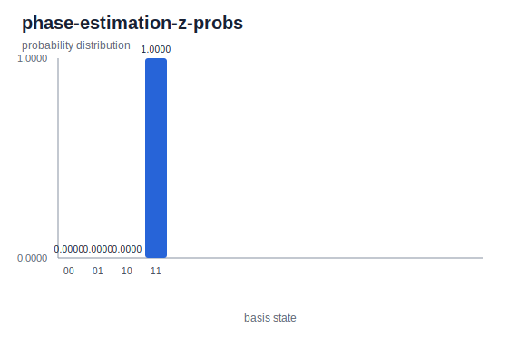

# Phase Estimation

> Extract the eigenphase of a unitary with an ancilla register, a controlled-\\( U \\) ladder, and an inverse QFT readout — the subroutine at the heart of Shor, HHL, and ground-state energy estimation.

## Background

Quantum phase estimation (QPE) solves the following problem. Given a unitary
\\( U \\) and an eigenstate \\( |\psi\rangle \\) with
\\( U|\psi\rangle = e^{2\pi i \varphi}|\psi\rangle \\) for some
\\( \varphi \in [0, 1) \\), produce an approximation of \\( \varphi \\) to
\\( t \\) bits of precision. It is the central subroutine in Shor's factoring
algorithm, in HHL linear solving, and in ground-state energy estimation for
quantum chemistry: every one of those algorithms ultimately converts a
physically interesting quantity into an eigenphase and reads it out with QPE.

Kitaev introduced the algorithm in 1995[^kitaev]; the polished "ancilla
register + inverse QFT" form we use today is due to Cleve, Ekert,
Macchiavello, and Mosca[^cemm]. Nielsen and Chuang cover it in §5.2[^nc].

The example on this page is the smallest non-trivial case: one ancilla qubit
estimating the eigenphase of \\( Z \\) on its \\( -1 \\)-eigenstate
\\( |1\rangle \\). With \\( t = 1 \\) ancilla bit the inverse QFT collapses to
a single Hadamard, so the whole algorithm fits in four gates — and every step
of the general recipe remains visible.

## The math

Fix a unitary \\( U \\) and an eigenstate \\( |\psi\rangle \\) with
eigenphase \\( \varphi \\). Use \\( t \\) *ancilla* qubits (the "counting
register") together with the eigenstate on a separate register.

**Step 1.** Initialize the ancilla to \\( |0\rangle^{\otimes t} \\) and apply
\\( H^{\otimes t} \\):

$$ |0\rangle^{\otimes t} \;\longmapsto\; \frac{1}{\sqrt{2^t}} \sum_{k=0}^{2^t - 1} |k\rangle. $$

**Step 2.** For \\( j = 0, 1, \dots, t-1 \\), apply \\( U^{2^j} \\) to the
eigenstate register conditioned on ancilla qubit \\( j \\) being \\( |1\rangle \\).
Each controlled \\( U^{2^j} \\) leaves \\( |\psi\rangle \\) unchanged up to a
global phase \\( e^{2\pi i \varphi \cdot 2^j} \\), and *kickback* puts that
phase on the \\( |1\rangle \\) branch of the control ancilla. Summing over the
\\( t \\) ancillae, the joint state becomes

$$ \frac{1}{\sqrt{2^t}} \sum_{k=0}^{2^t - 1} e^{2\pi i \varphi k}\,|k\rangle \;\otimes\; |\psi\rangle. $$

The eigenstate is unchanged; the ancilla register now carries \\( \varphi \\)
in its Fourier amplitudes.

**Step 3.** Apply the *inverse* QFT to the ancilla. By the definition of the
QFT, if \\( \varphi = m / 2^t \\) for some integer \\( m \\) then the inverse
QFT maps the Fourier-encoded state back to the computational basis state
\\( |m\rangle \\), and measurement returns the binary expansion of
\\( \varphi \\) with certainty. For generic \\( \varphi \\) the output peaks
at \\( \lfloor 2^t \varphi \rceil \\) with width \\( \sim 1/2^t \\), so the
measured bitstring is the best \\( t \\)-bit approximation of \\( \varphi \\)
with high probability.

**Precision trade.** One additional ancilla bit doubles the resolution of
\\( \varphi \\) but requires one further controlled application with the
highest power \\( U^{2^{t-1}} \\). You trade circuit depth (larger \\( U \\)
powers) for output precision.

**The worked case \\( t = 1 \\), \\( U = Z \\).** The \\( -1 \\)-eigenstate
of \\( Z \\) is \\( |1\rangle \\): since \\( Z|1\rangle = -|1\rangle = e^{i\pi}|1\rangle \\),
the eigenphase is \\( \varphi = 1/2 \\). With \\( t = 1 \\) the algorithm
needs only one controlled application (\\( U^{2^0} = U \\), no higher powers)
and the inverse QFT on a single qubit is literally \\( H \\). Tracing the
state:

$$ |0\rangle|1\rangle \xrightarrow{H_0} \frac{|0\rangle + |1\rangle}{\sqrt{2}}\,|1\rangle \xrightarrow{\text{C-}Z} \frac{|0\rangle - |1\rangle}{\sqrt{2}}\,|1\rangle = |{-}\rangle\,|1\rangle \xrightarrow{H_0} |1\rangle|1\rangle. $$

The final Hadamard maps \\( |-\rangle \to |1\rangle \\) deterministically; the
ancilla reads \\( 1 \\), which is the single-bit binary expansion
\\( 0.1_\text{binary} = 1/2 = \varphi \\). The eigenstate \\( |1\rangle \\)
stays put, as it should.

## The circuit


Four elements on two qubits. Qubit 0 is the ancilla; qubit 1 holds the
eigenstate. The JSON follows the
[Circuit JSON Conventions](../conventions.md):

```json
{
  "num_qubits": 2,
  "elements": [
    {"type": "gate", "gate": "X", "targets": [1]},
    {"type": "gate", "gate": "H", "targets": [0]},
    {"type": "gate", "gate": "Z", "targets": [1], "controls": [0]},
    {"type": "gate", "gate": "H", "targets": [0]}
  ]
}
```

Map each gate back to a step of the general algorithm:

1. `X` on q1 prepares the eigenstate \\( |1\rangle \\). This replaces the
   "start with \\( |\psi\rangle \\) in the system register" assumption that
   the general algorithm takes for granted.
2. `H` on q0 is the \\( t = 1 \\) case of \\( H^{\otimes t} \\); it puts the
   ancilla in \\( |+\rangle \\).
3. Controlled-`Z` with control q0, target q1 applies \\( U^{2^0} = Z \\) to
   the eigenstate when the ancilla is \\( |1\rangle \\). Eigenphase kickback
   puts the phase \\( -1 \\) on the \\( |1\rangle \\) branch of q0, turning
   \\( |+\rangle \\) into \\( |-\rangle \\).
4. `H` on q0 is the inverse QFT on a single qubit (QFT\\(_1\\) and its inverse
   are both \\( H \\)), converting the phase difference into a
   computational-basis bit.

[Full phase-estimation circuit JSON](./generated/circuits/phase-estimation-z.json).

> **Bit ordering callout.** In yao-rs, qubit 0 is the *most* significant bit
> of the index. On this circuit the ancilla is q0 and the eigenstate register
> is q1, so in \\( |q_0 q_1\rangle \\) notation the *left* bit is the ancilla
> that carries the answer and the *right* bit is the system register. See
> [bit ordering](../conventions.md#bit-ordering) for the convention.

## Running it

**Quick run** — download the
[phase-estimation circuit JSON](./generated/circuits/phase-estimation-z.json),
then (with `yao` on PATH):

```bash
yao simulate phase-estimation-z.json | yao probs -
```

Expected output:

```text
{
  "locs": null,
  "num_qubits": 2,
  "probabilities": [
    0.0,
    0.0,
    0.0,
    1.0000000000000004
  ]
}
```

**Regenerating this page's artifacts** from the repo root (via the bundled
shell workflow):

```bash
cargo build -p yao-cli --no-default-features
YAO_ARTIFACT_DIR=docs/src/examples/generated YAO_BIN=target/debug/yao bash examples/cli/phase_estimation_z.sh
python3 scripts/plot_cli_results.py docs/src/examples/generated/results docs/src/examples/generated/plots
```

## Interpreting the result



The probability array is `[0, 0, 0, 1]`. All weight sits on index 3, which in
the qubit-0-MSB convention is \\( |q_0 q_1\rangle = |11\rangle \\): the
ancilla \\( q_0 = 1 \\) and the system register \\( q_1 = 1 \\). Reading the
two bits separately gives exactly what the algorithm promises.

- \\( q_0 = 1 \\) is the single-bit binary expansion of the eigenphase:
  \\( \varphi = 0.1_\text{binary} = 1/2 \\). This is the estimate produced by
  the ancilla register.
- \\( q_1 = 1 \\) is the eigenstate \\( |1\rangle \\), preserved by the
  controlled-\\( U \\) step (QPE never disturbs the eigenstate — only kicks
  its phase onto the ancilla).

Connecting back to the general algorithm: with \\( t = 1 \\) the ancilla can
only resolve \\( \varphi \\) to within \\( 1/2 \\) — it distinguishes the
half-plane \\( \varphi \in [1/4, 3/4) \\) (bit \\( 1 \\)) from the complement
\\( [0, 1/4) \cup [3/4, 1) \\) (bit \\( 0 \\)). The eigenphase of \\( Z \\)
lands exactly on \\( 1/2 \\), the midpoint of the "bit \\( 1 \\)" range, and
happens to be a dyadic fraction \\( m / 2^t \\) with \\( t = 1, m = 1 \\), so
the inverse QFT returns \\( |1\rangle \\) deterministically.

For a \\( \varphi \\) that is *not* a dyadic fraction \\( m / 2^t \\), the
deterministic peak spreads into a distribution over ancilla outcomes with
weight concentrated near \\( \lfloor 2^t \varphi \rceil \\) and tails that
decay as \\( 1/k^2 \\) in the distance from the peak. To sharpen a blurred
estimate one either adds ancilla bits (doubling resolution per bit) or runs
the algorithm multiple times and majority-votes the high-order bits. Tracked
for later expansion in issue #32.

## Variations & next steps

- **More ancilla bits.** The natural follow-up is full \\( t \\)-bit QPE on a
  general \\( U \\): \\( t \\) ancilla qubits, controlled \\( U^{2^j} \\) for
  \\( j = 0, \dots, t-1 \\), and an inverse QFT over the ancilla register.
  The four-gate example on this page is the \\( t = 1 \\) special case.
- **Other unitaries.** Any single-qubit unitary with an eigenphase that is a
  dyadic fraction admits an exact QPE with the right number of ancilla bits;
  for example, the T gate has eigenphase \\( 1/8 \\) and is resolved exactly
  with \\( t = 3 \\).
- **The QFT subroutine.** See
  [Quantum Fourier Transform](./qft.md) for the block that performs the
  Fourier encoding and its inverse — this is the stage that converts phase
  information into a measurable bitstring.
- **One-ancilla expectation values.** See
  [Ancilla Protocols](./ancilla-protocols.md) for the closely related
  Hadamard-test pattern: one ancilla, controlled-\\( U \\), Hadamard, and the
  ancilla's expectation value reads off \\( \text{Re}\,\langle\psi|U|\psi\rangle \\).
  The \\( t = 1 \\) QPE above is the special case where \\( |\psi\rangle \\)
  is an eigenstate.
- **Deferred.** HHL and Shor build on QPE (see issue #32 for time-evolution
  oracles and issue #35 for the modular-arithmetic oracles that Shor needs).

## References

[^kitaev]: A. Y. Kitaev, "Quantum measurements and the Abelian stabilizer
    problem", arXiv:quant-ph/9511026 (1995).

[^cemm]: R. Cleve, A. Ekert, C. Macchiavello, and M. Mosca, "Quantum
    algorithms revisited", *Proc. R. Soc. A* **454**, 339 (1998).

[^nc]: M. A. Nielsen and I. L. Chuang, *Quantum Computation and Quantum
    Information*, 10th Anniversary Edition (Cambridge University Press,
    2010), §5.2 (phase estimation).
