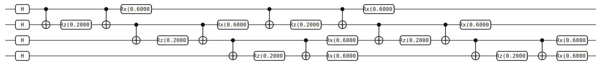

# QAOA for MaxCut

> Alternate cost-Hamiltonian and mixer propagators on a uniform superposition
> to variationally prepare a state whose expectation on the cost operator
> approximates the MaxCut. This page builds the ansatz for a 4-vertex line
> graph at fixed (untrained) parameters and reads out one edge expectation.

## Background

The Quantum Approximate Optimization Algorithm (QAOA) is a variational
algorithm for combinatorial optimization on near-term quantum hardware,
introduced by Farhi, Goldstone, and Gutmann in 2014[^fgg]. It prepares a
parameterized trial state by alternating two short propagators — one built
from the problem's cost Hamiltonian, one a simple transverse-field mixer —
and hands the expectation value back to a classical optimizer that tunes
the parameters.

MaxCut is the canonical target problem. Given a graph \\( G = (V, E) \\),
partition \\( V \\) into two sets so as to maximize the number of edges
with one endpoint on each side. The decision version is NP-complete, but
QAOA gives a *provable* approximation at the smallest depth \\( p = 1 \\):
Farhi et al. showed a guaranteed ratio of \\( 0.6924 \\) on 3-regular
graphs, and empirical evidence has it improving as \\( p \\) grows.
Whether QAOA ever beats the best classical approximation algorithm
(Goemans–Williamson at \\( 0.87856 \\)[^gw]) is an open question, and part of
the reason MaxCut-QAOA is the standard benchmark for variational
quantum algorithms.

**Static-parameter warning.** This example builds the ansatz at *fixed*
\\( \gamma \\) and \\( \beta \\); it does not run a classical optimizer.
The page shows how the circuit is assembled from CNOT-sandwich
\\( ZZ \\)-rotations and \\( X \\)-rotations, and how a single edge
expectation is evaluated. The training loop — picking an optimizer,
feeding it the expectation, and iterating — is deferred and tracked in
issue #31[^issue31]. The expectation reported here is therefore *not*
near the MaxCut optimum.

## The math

Encode a two-coloring of \\( V \\) in the computational basis by identifying
\\( |0\rangle \\) with one side and \\( |1\rangle \\) with the other. The
operator \\( Z_i \\) acts as \\( Z_i|0\rangle = +|0\rangle \\),
\\( Z_i|1\rangle = -|1\rangle \\), so \\( Z_iZ_j = +1 \\) when vertices
\\( i, j \\) are on the same side and \\( -1 \\) when they are on opposite
sides. The projector onto "cut" for edge \\( (i, j) \\) is
\\( \tfrac{1}{2}(1 - Z_iZ_j) \\), and summing over edges gives the cost
Hamiltonian

$$ H_C \;=\; \sum_{(i,j) \in E} \frac{1 - Z_iZ_j}{2}. $$

On any computational-basis state, \\( \langle H_C \rangle \\) equals the
number of edges cut by the corresponding partition, so maximizing the
expectation over trial states is the MaxCut problem.

**Mixer.** Let \\( H_B = \sum_i X_i \\). Its ground state is
\\( |+\rangle^{\otimes n} = H^{\otimes n}|0\rangle^{\otimes n} \\), the
uniform superposition.

**Ansatz.** Start in \\( |+\rangle^{\otimes n} \\) and apply \\( p \\)
alternating layers of cost and mixer propagators:

$$ |\psi_p(\boldsymbol\gamma, \boldsymbol\beta)\rangle \;=\; e^{-i\beta_p H_B}\,e^{-i\gamma_p H_C}\cdots e^{-i\beta_1 H_B}\,e^{-i\gamma_1 H_C}\,|+\rangle^{\otimes n}. $$

The variational parameters are the \\( 2p \\) real angles
\\( (\gamma_1, \beta_1, \dots, \gamma_p, \beta_p) \\). A classical
optimizer maximizes
\\( F_p(\boldsymbol\gamma, \boldsymbol\beta) = \langle\psi_p|H_C|\psi_p\rangle \\).

**Cost-propagator decomposition.** The edge terms \\( Z_iZ_j \\) commute
pairwise (they all live in the \\( Z \\) basis), so the cost propagator
factors over edges:

$$ e^{-i\gamma H_C} \;=\; e^{i\gamma|E|/2}\!\!\prod_{(i,j) \in E} e^{i\gamma Z_iZ_j / 2}. $$

The global phase \\( e^{i\gamma|E|/2} \\) is unobservable and is dropped.
Each two-qubit factor compiles on hardware using the identity

$$ e^{-i\theta Z_iZ_j} \;=\; \mathrm{CNOT}_{i \to j}\,\cdot\,R_z(2\theta)_j\,\cdot\,\mathrm{CNOT}_{i \to j}. $$

The CNOT sandwich converts the single-qubit \\( R_z \\) phase on qubit
\\( j \\) into the two-qubit \\( ZZ \\) phase on the \\( (i, j) \\) pair.
This is what you will see in the circuit JSON — three gates per edge, per
layer.

**Mixer decomposition.** \\( H_B \\) is a sum of commuting single-qubit
\\( X \\)s, so

$$ e^{-i\beta H_B} \;=\; \prod_i e^{-i\beta X_i} \;=\; \prod_i R_x(2\beta)_i. $$

**The factor-of-two convention.** yao-rs follows the textbook definitions

$$ R_z(\theta) \;=\; e^{-i\theta Z / 2}, \qquad R_x(\theta) \;=\; e^{-i\theta X / 2}, $$

so the angle you *pass* to `Rz` or `Rx` is twice the effective QAOA angle.
The script below uses `Rz(0.2)` and `Rx(0.6)`, which realize
\\( e^{-i \cdot 0.1\,Z_iZ_j} \\) and \\( e^{-i \cdot 0.3\,X_i} \\) — i.e.
effective \\( \gamma = 0.1 \\) and \\( \beta = 0.3 \\). This doubling trips
up everyone who writes their first QAOA circuit; mind it.

**Readout via a single edge.** The MaxCut cost decomposes as

$$ \langle H_C \rangle \;=\; \frac{|E|}{2} - \frac{1}{2}\sum_{(i,j) \in E}\langle Z_iZ_j \rangle, $$

so evaluating each \\( \langle Z_iZ_j \rangle \\) is enough to reconstruct
the full cost. The CLI example below reads out *one* of those edge
expectations, \\( \langle Z_0 Z_1 \rangle \\); summing \\( |E| \\) such
runs would give the whole cost.

## The circuit



Thirty elements on four qubits. The graph is the 4-vertex line
\\( 0 - 1 - 2 - 3 \\) with edge set
\\( E = \{(0,1), (1,2), (2,3)\} \\); depth is \\( p = 2 \\).
Counting: four Hadamards in the initial layer plus \\( 2 \times (3 \times 3 + 4) = 2 \times 13 = 26 \\) gates across the two QAOA blocks (three CNOT-sandwich triples plus four mixer rotations each), totalling 30. The full
JSON follows the [Circuit JSON Conventions](../conventions.md).

The first layer prepares the uniform superposition, and each QAOA block
then consists of a cost half (three edge-\\( ZZ \\) sandwiches, taken in
the order \\( (0,1), (1,2), (2,3) \\)) followed by a mixer half (four
\\( R_x \\)s). The JSON excerpt below covers the initial Hadamards, one
edge-\\( ZZ \\) sandwich, and the mixer layer of the first block:

```json
{
  "num_qubits": 4,
  "elements": [
    {"type": "gate", "gate": "H", "targets": [0]},
    {"type": "gate", "gate": "H", "targets": [1]},
    {"type": "gate", "gate": "H", "targets": [2]},
    {"type": "gate", "gate": "H", "targets": [3]},
    {"type": "gate", "gate": "X", "targets": [1], "controls": [0]},
    {"type": "gate", "gate": "Rz", "targets": [1], "params": [0.2]},
    {"type": "gate", "gate": "X", "targets": [1], "controls": [0]},
    {"type": "gate", "gate": "Rx", "targets": [0], "params": [0.6]},
    {"type": "gate", "gate": "Rx", "targets": [1], "params": [0.6]},
    {"type": "gate", "gate": "Rx", "targets": [2], "params": [0.6]},
    {"type": "gate", "gate": "Rx", "targets": [3], "params": [0.6]}
  ]
}
```

The three-gate CNOT-\\( R_z \\)-CNOT pattern on qubits \\( (0, 1) \\) is
the edge-\\( (0,1) \\) \\( ZZ \\)-rotation. The other two edges
\\( (1, 2) \\) and \\( (2, 3) \\) follow the same pattern and are omitted
from the excerpt. The mixer layer is four \\( R_x(0.6) \\)s, one per
qubit. The second QAOA block is bit-for-bit identical to the first.
[Full QAOA JSON](./generated/circuits/qaoa-maxcut-line4-depth2.json)
(30 elements).

> **Bit ordering callout.** The readout on this page is an expectation
> value, which does not depend on how the probability-array index is
> labeled. But if you swap `yao run --op` for `yao probs` to inspect the
> full output distribution, remember that qubit 0 is the *most*
> significant bit of the index: index 5 on four qubits is
> \\( |q_0 q_1 q_2 q_3\rangle = |0101\rangle \\). See
> [bit ordering](../conventions.md#bit-ordering) for the full rule.

## Running it

**Quick run** — download the
[QAOA circuit JSON](./generated/circuits/qaoa-maxcut-line4-depth2.json)
and compute an expectation value directly with `yao run --op`:

```bash
yao run qaoa-maxcut-line4-depth2.json --op "Z(0)Z(1)"
```

Expected output:

```text
{
  "expectation_value": {
    "im": 0.0,
    "re": 0.30738930204770754
  },
  "operator": "Z(0)Z(1)"
}
```

`yao run --op` returns a single real number (the expectation value)
rather than a probability distribution; the imaginary part is zero by
construction (the expectation of a Hermitian operator is real).

**Regenerating this page's artifacts** from the repo root:

```bash
cargo build -p yao-cli --no-default-features
YAO_ARTIFACT_DIR=docs/src/examples/generated YAO_BIN=target/debug/yao bash examples/cli/qaoa_maxcut_line4.sh 2
python3 scripts/plot_cli_results.py docs/src/examples/generated/results docs/src/examples/generated/plots
```

The script's shell wrapper invokes the same `yao run --op "Z(0)Z(1)"` call
and writes the result JSON under
`docs/src/examples/generated/results/`. The plotting script renders
expectation files as a single bar at
`docs/src/examples/generated/plots/qaoa-maxcut-line4-depth2-expect.svg`.

## Interpreting the result


The result JSON reports `expectation_value.re = 0.3074` and
`expectation_value.im = 0.0`. The imaginary part is zero by construction
— the expectation of a Hermitian operator on any state is real — and
`Z(0)Z(1)` is the Pauli product \\( Z_0 \otimes Z_1 \\) padded with
identities on qubits 2 and 3.

The *sign* of \\( \langle Z_0 Z_1 \rangle \\) tells you which way the
trial state leans on edge \\( (0, 1) \\). A value near \\( +1 \\) means
the two qubits are strongly correlated in the computational basis —
partition-same, edge-uncut. A value near \\( -1 \\) means they are
strongly anti-correlated — partition-split, edge-cut. For MaxCut we want
each \\( \langle Z_iZ_j \rangle \\) close to \\( -1 \\).

**Baseline check.** The initial state \\( |+\rangle^{\otimes 4} \\) is a
product of independent uniform bits, so every \\( \langle Z_iZ_j \rangle \\)
on it is zero. The depth-2 block at \\( \gamma = 0.1 \\) and
\\( \beta = 0.3 \\) pushes \\( \langle Z_0 Z_1 \rangle \\) to
\\( +0.307 \\) — that is, *away* from the MaxCut optimum. The 4-vertex
line has a unique MaxCut of value 3 (alternating assignment
\\( 0101 \\) or \\( 1010 \\) cuts every edge), at which
\\( \langle H_C \rangle = 3 \\) and each individual
\\( \langle Z_iZ_j \rangle = -1 \\). The gap between \\( +0.307 \\) and
\\( -1 \\) is what a proper parameter optimization would close; hand-picked
angles have no reason to produce a useful cut, and indeed they do not.

This is a feature, not a bug: the QAOA ansatz is a generic
parameterized state-preparation circuit whose cost landscape over
\\( (\boldsymbol\gamma, \boldsymbol\beta) \\) is non-trivial, and
finding the good valleys is the classical optimizer's job. Seeing a bad
value at a hand-picked point confirms the ansatz responds to its
parameters.

### Verifying correctness

The number above — \\( \langle Z_0 Z_1\rangle = 0.307389\ldots \\) — does
not match an obvious closed form, so checking it requires a second
simulator. `scripts/reference_simulate.py` is an independent numpy
state-vector implementation in ~80 lines; running it on the same circuit
JSON and computing the same Pauli operator must give the same value, to
within machine precision:

```bash
python3 scripts/reference_simulate.py \
    docs/src/examples/generated/circuits/qaoa-maxcut-line4-depth2.json \
    --op "Z(0)Z(1)"
```

Expected output:

```text
{"expectation_value": {"re": 0.3073893020477073, "im": 0.0}}
```

The CLI result from the run above is `0.3073893020477075`. The two
values differ by \\( 2.8 \times 10^{-16} \\) — one unit in the last
place of complex-double arithmetic — and the imaginary parts are
identically zero. Because the reference and the CLI agree to the bit
despite being independent implementations in different languages
(Python+numpy vs. Rust), the agreement pins down both the circuit
construction in the shell script and the matrix application in the
simulator. A bug in either would show up as a visible disagreement.

## Variations & next steps

- **Increase depth.** Pass `3` or `4` as the script's first argument.
  Each extra layer adds one more \\( (\gamma, \beta) \\) pair and
  \\( |E| \cdot 3 + n \\) gates. Empirically, the optimized cost at
  larger \\( p \\) approaches the true MaxCut.
- **Change the graph.** Edit the edge list in
  `examples/cli/qaoa_maxcut_line4.sh` to a ring
  \\( (0,1), (1,2), (2,3), (3,0) \\), a random graph, or any other
  topology. The CNOT-sandwich pattern adapts one edge at a time.
- **Full cost readout.** Run `yao run --op` once per edge and sum the
  results via the identity \\( \langle H_C\rangle = |E|/2 - \tfrac{1}{2}\sum \langle Z_iZ_j\rangle \\).
  For this example's three edges on the line-4 graph, evaluating
  \\( \langle Z_0Z_1\rangle, \langle Z_1Z_2\rangle, \langle Z_2Z_3\rangle \\)
  and summing recovers the full QAOA objective.
- **Parameter optimization (deferred).** The classical outer loop — a
  Nelder–Mead, SPSA, or parameter-shift gradient optimizer wrapped
  around `yao run --op` — is tracked in issue #31[^issue31].
- **Related circuits.** See [Ancilla Protocols](./ancilla-protocols.md)
  for the Hadamard test, a standard subroutine for evaluating Pauli
  expectations on a hardware register. For a different variational
  ansatz with a different loss function, see
  [Quantum Circuit Born Machine](./qcbm.md).

## References

[^fgg]: E. Farhi, J. Goldstone, and S. Gutmann, "A Quantum Approximate
    Optimization Algorithm", arXiv:1411.4028 (2014).

[^gw]: M. X. Goemans and D. P. Williamson, "Improved approximation
    algorithms for maximum cut and satisfiability problems using
    semidefinite programming", *J. ACM* **42**, 1115 (1995);
    the randomized-rounding algorithm achieves expected cut
    \\( \geq 0.87856 \\cdot \\mathrm{OPT} \\).

[^issue31]: yao-rs issue #31, "Parameter-optimization loop for
    variational examples". Tracks the planned training harness for QAOA
    and VQE-style workflows.
