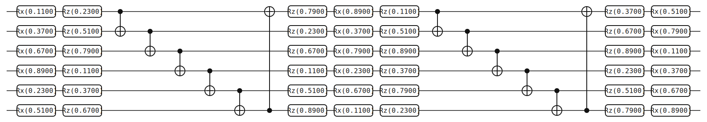
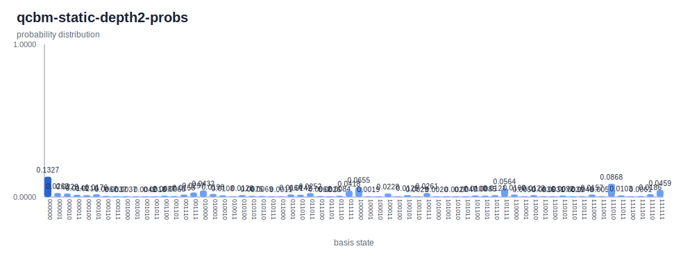

# Quantum Circuit Born Machine

> A parameterized quantum circuit samples a probability distribution over basis
> states via Born's rule; train the parameters to match a target distribution.
> This page lays out the ansatz — alternating single-qubit rotations and CNOT
> entangler rings — runs it at a fixed non-zero parameter schedule, and
> cross-checks the output distribution against an independent numpy simulator.

## Background

The Quantum Circuit Born Machine (QCBM) is a quantum-native generative model
introduced by Liu and Wang in 2018[^lw]. A parameterized quantum circuit
\\( U(\boldsymbol\theta) \\) acting on \\( |0\rangle^{\otimes n} \\) prepares
a state whose computational-basis measurement distribution — the *Born
distribution* — is the generative distribution. One trains
\\( \boldsymbol\theta \\) so that this distribution matches a target
\\( \pi \\) given as either samples or a full histogram.

Two features make the QCBM worth studying. First, it is *quantum-native*:
there is no hand-designed score function or invertibility constraint; the
model is the circuit, and sampling is a measurement. Second, with enough
layers and entanglers it can represent distributions that classical
autoregressive models struggle with. The cost is trainability — loss
landscapes are non-convex and *barren plateaus* (exponentially vanishing
gradients as qubit count grows) show up as depth grows[^bp].

This page shows the canonical ansatz — rotation layers separated by CNOT
entangler rings — at a fixed, deterministic parameter schedule. No
training loop is invoked; the schedule is chosen only to make the output
non-trivial and reproducible. Training is deferred to issue
#31[^issue31]. For a second variational ansatz on this site, see
[QAOA for MaxCut](./qaoa-maxcut.md); both are parameterized circuits,
but QAOA optimizes an expectation value while the QCBM optimizes a
distribution distance.

## The math

**Born's rule defines a distribution.** Given a parameterized circuit
\\( U(\boldsymbol\theta) \\) acting on \\( |0\rangle^{\otimes n} \\), the
output state is
\\( |\psi(\boldsymbol\theta)\rangle = U(\boldsymbol\theta)|0\rangle^{\otimes n} \\)
and the Born distribution is

$$ p_{\boldsymbol\theta}(x) \;=\; |\langle x | \psi(\boldsymbol\theta)\rangle|^2, \qquad x \in \{0, 1\}^n. $$

Sampling from \\( p_{\boldsymbol\theta} \\) is a single measurement in the
computational basis. Evaluating \\( p_{\boldsymbol\theta}(x) \\) at a
specific \\( x \\) is easy in simulation; on hardware it is estimated from
repeated samples.

**Ansatz structure.** A QCBM alternates *rotation layers* and *entangler
layers*.

- A rotation layer applies a single-qubit rotation chain to each qubit.
  Two common choices are `Rx(θ₁)·Rz(θ₂)` (two parameters, sufficient for
  the "edge" layers where an adjacent entangler erases one redundant
  degree of freedom) and the three-gate `Rz(θ₁)·Rx(θ₂)·Rz(θ₃)` triple
  (three parameters, an arbitrary single-qubit unitary up to a global
  phase).
- An entangler layer is a fixed pattern of two-qubit gates. The standard
  choice — and the one this example uses — is a *CNOT ring*
  \\( 0 \to 1 \to 2 \to \cdots \to n-1 \to 0 \\).
- A *depth-\\( p \\)* ansatz has \\( p+1 \\) rotation layers separated by
  \\( p \\) entangler layers. Using the edge/middle split above the total
  parameter count is \\( 4n + 3n(p-1) \\) — linear in both \\( n \\) and
  \\( p \\).

**Loss function: maximum mean discrepancy.** Given a target distribution
\\( \pi \\) over \\( \{0, 1\}^n \\) and a kernel \\( K \\), the MMD loss is

$$ \mathrm{MMD}^2(p_{\boldsymbol\theta}, \pi) \;=\; \mathbb{E}_{x,x' \sim p_{\boldsymbol\theta}} K(x, x') - 2\,\mathbb{E}_{x \sim p_{\boldsymbol\theta},\,y \sim \pi} K(x, y) + \mathbb{E}_{y, y' \sim \pi} K(y, y'). $$

For a *characteristic* kernel (e.g. a Gaussian RBF),
\\( \mathrm{MMD}^2 = 0 \\) if and only if
\\( p_{\boldsymbol\theta} = \pi \\). The critical property for quantum
hardware is that each expectation above is estimable from samples alone —
the model never needs to evaluate \\( p_{\boldsymbol\theta}(x) \\)
explicitly.

**Gradients: parameter-shift.** For any rotation parameter \\( \theta \\)
that enters as \\( R_\bullet(\theta) = e^{-i\theta\,\bullet/2} \\) with
\\( \bullet \in \{X, Y, Z\} \\), the exact gradient of any expectation
value satisfies the two-point formula[^ps]

$$ \frac{\partial \langle O \rangle_{\boldsymbol\theta}}{\partial \theta} \;=\; \frac{1}{2}\bigl(\langle O \rangle_{\boldsymbol\theta + \tfrac{\pi}{2}\mathbf{e}} - \langle O \rangle_{\boldsymbol\theta - \tfrac{\pi}{2}\mathbf{e}}\bigr), $$

where \\( \mathbf{e} \\) is the unit vector for the parameter being
differentiated. The MMD loss is a linear combination of kernel
expectations and inherits this rule, so unbiased gradient estimates come
from two circuit evaluations per parameter.

**Expressivity trade-off.** Shallow circuits are easy to train but cover
few distributions; deep circuits can represent more but their loss
landscapes develop exponentially flat regions (barren plateaus). Choosing
the right depth is a hyperparameter tune and an active research area.

## The circuit



Fifty-four gates on six qubits at depth \\( p = 2 \\). The layout is

- First rotation layer: `Rx(θ), Rz(θ)` on each of the six qubits
  — 12 gates, two parameters per qubit.
- Entangler ring: CNOTs
  \\( 0{\to}1, 1{\to}2, 2{\to}3, 3{\to}4, 4{\to}5, 5{\to}0 \\)
  — 6 gates.
- Middle rotation layer: `Rz(θ), Rx(θ), Rz(θ)` on each qubit
  — 18 gates, three parameters per qubit.
- Entangler ring: identical to the first — 6 gates.
- Last rotation layer: `Rz(θ), Rx(θ)` on each qubit — 12 gates, two
  parameters per qubit.

Total parameter count at this depth is \\( 2 \cdot 6 + 3 \cdot 6 + 2 \cdot 6 = 42 \\).
The script assigns angles by cycling through the fixed pool
`{0.11, 0.23, 0.37, 0.51, 0.67, 0.79, 0.89}` in the order the parameters
appear in the circuit, so the output is reproducible and independent of
any RNG state, but no rotation is the identity.

The JSON excerpt below shows the first rotation layer, the full first
CNOT ring, and the first `Rz·Rx·Rz` triple of the middle rotation layer
(15 elements out of 54). The format follows the
[Circuit JSON Conventions](../conventions.md):

```json
{
  "num_qubits": 6,
  "elements": [
    {"type": "gate", "gate": "Rx", "targets": [0], "params": [0.11]},
    {"type": "gate", "gate": "Rz", "targets": [0], "params": [0.23]},
    {"type": "gate", "gate": "Rx", "targets": [1], "params": [0.37]},
    {"type": "gate", "gate": "Rz", "targets": [1], "params": [0.51]},
    {"type": "gate", "gate": "Rx", "targets": [2], "params": [0.67]},
    {"type": "gate", "gate": "Rz", "targets": [2], "params": [0.79]},
    {"type": "gate", "gate": "X", "targets": [1], "controls": [0]},
    {"type": "gate", "gate": "X", "targets": [2], "controls": [1]},
    {"type": "gate", "gate": "X", "targets": [3], "controls": [2]},
    {"type": "gate", "gate": "X", "targets": [4], "controls": [3]},
    {"type": "gate", "gate": "X", "targets": [5], "controls": [4]},
    {"type": "gate", "gate": "X", "targets": [0], "controls": [5]},
    {"type": "gate", "gate": "Rz", "targets": [0], "params": [0.23]},
    {"type": "gate", "gate": "Rx", "targets": [0], "params": [0.37]},
    {"type": "gate", "gate": "Rz", "targets": [0], "params": [0.51]}
  ]
}
```

The last three `Rx·Rz` pairs of the first rotation layer (qubits 3, 4, 5)
and the remaining per-qubit `Rz·Rx·Rz` triples of the middle layer follow
the same cycling pattern; the second entangler ring is bit-for-bit
identical to the first; and the last rotation layer reverts to the
two-gate `Rz·Rx` pattern. [Full QCBM JSON](./generated/circuits/qcbm-static-depth2.json).

> **Bit ordering callout.** yao-rs places qubit 0 at the *most*
> significant bit of the probability-array index. Index 58 above reads
> \\( 111010_2 \\) as \\( |q_0 q_1 q_2 q_3 q_4 q_5\rangle = |111010\rangle \\):
> the leftmost bit is qubit 0. See
> [bit ordering](../conventions.md#bit-ordering) for the full rule.

## Running it

**Quick run** — download the
[QCBM circuit JSON](./generated/circuits/qcbm-static-depth2.json)
and simulate:

```bash
yao simulate qcbm-static-depth2.json | yao probs -
```

Expected output — first and last few entries of the 64-element probability
vector (see the "Verifying correctness" subsection below for the full-vector
invariants):

```text
{
  "locs": null,
  "num_qubits": 6,
  "probabilities": [
    0.13268155794686642,
    0.026288662539464103,
    0.0229141740332291,
    ...
    0.08675812653019756,
    ...,
    0.04593274455545663
  ]
}
```

**Regenerating this page's artifacts** from the repo root:

```bash
cargo build -p yao-cli --no-default-features
YAO_ARTIFACT_DIR=docs/src/examples/generated YAO_BIN=target/debug/yao bash examples/cli/qcbm_static.sh 2
python3 scripts/plot_cli_results.py docs/src/examples/generated/results docs/src/examples/generated/plots
```

## Interpreting the result



The output is a spread distribution over all 64 basis states. The top
five probabilities are

| Index | Binary | Probability |
|---|---|---|
| 0 | `000000` | `0.1327` |
| 58 | `111010` | `0.0868` |
| 32 | `100000` | `0.0655` |
| 47 | `101111` | `0.0564` |
| 63 | `111111` | `0.0459` |

and the Shannon entropy is \\( H(p) \approx 5.075 \\) bits, versus
\\( \log_2 64 = 6.000 \\) for the uniform distribution on 64 outcomes —
so the distribution is clearly non-uniform (some basis states are
favoured) but far from a delta (no single outcome dominates). This is
the qualitative fingerprint of a parameterized quantum circuit away
from both the identity and the trained optimum: energy has flowed out
of \\( |0\rangle^{\otimes 6} \\) via the rotations and been
redistributed by the CNOT rings.

The initial state is \\( |0\rangle^{\otimes 6} \\); the first rotation
layer uses small angles (0.11 and 0.23 in radians on qubit 0), so most
probability stays near low-Hamming-weight outputs. That is why index
\\( 0 \\) retains the largest weight (\\( 13\% \\)) — but it is one of
64 bins, not the whole distribution.

### Verifying correctness

Two invariants should hold exactly; the measured output satisfies both.

**Invariant 1: probabilities sum to 1.** Summing the 64 entries of
`qcbm-static-depth2-probs.json` gives
\\( \sum_k p_k = 1.000000000000001 \\) — i.e. equal to 1 to within one
part in \\( 10^{15} \\). Unitarity is the whole content of this check:
every gate preserves \\( \|\psi\| = 1 \\), so Born probabilities must
sum to 1 for any circuit regardless of depth or parameters. A violation
here would flag a bug in the simulator, not in the ansatz.

**Invariant 2: match against an independent simulator.** Run the
reference numpy simulator from `scripts/reference_simulate.py` on the
same circuit JSON and compare element-by-element:

```bash
python3 scripts/reference_simulate.py \
    docs/src/examples/generated/circuits/qcbm-static-depth2.json \
    --probs > /tmp/qcbm-reference.json

python3 -c "
import json
cli = json.load(open('docs/src/examples/generated/results/qcbm-static-depth2-probs.json'))['probabilities']
ref = json.load(open('/tmp/qcbm-reference.json'))['probabilities']
print(max(abs(c - r) for c, r in zip(cli, ref)))
"
```

Expected output:

```text
3.469446951953614e-18
```

That is machine epsilon (\\( \approx 2^{-52} \approx 2.2 \times 10^{-16} \\))
for complex-double arithmetic, divided by the scale of the individual
probability values — a bit-for-bit match between two independent
implementations. Unlike the \\( \boldsymbol\theta = 0 \\) special case,
this test depends on every rotation angle in the ansatz and every CNOT
in the entangler ring: change any one of them and the two outputs would
drift apart. It verifies the layered structure end-to-end.

A *trained* QCBM would put mass on the bitstrings favoured by a target
distribution. If the target were a truncated Gaussian over
\\( \{0, 1, \dots, 63\} \\), training should reshape the probability
array into a bell curve; if the target were the uniform distribution,
training should flatten it across all 64 bins. The spread observed here
is the fingerprint of a *hand-picked* parameter point — responsive to
its angles, but not optimized. Replacing the fixed schedule with the
output of a classical optimizer is the missing piece tracked in
issue #31[^issue31].

## Variations & next steps

- **Re-seed the parameter schedule.** Patch the `thetas` pool inside
  `examples/cli/qcbm_static.sh` — any non-zero vector of 7 values will
  produce a different but equally verifiable distribution. The
  CLI-vs-reference cross-check above holds for any schedule, so use this
  to probe how the ansatz responds to its parameters.
- **Change depth.** Pass `1` or `3` to the script. Parameter count
  scales as \\( 4n + 3n(p-1) \\); expressivity scales roughly
  linearly in \\( n \cdot p \\), with barren plateaus kicking in at
  larger depths[^bp].
- **Change entangler topology.** Swap the CNOT ring for a brick-wall
  pattern, a nearest-neighbor line, or a random 2-local pattern. Each
  topology biases the accessible distributions differently; rings are a
  common default because they maximize connectivity under minimal gate
  count.
- **Training loop (issue #31).** Compute the MMD loss against a target
  distribution, evaluate gradients via parameter-shift, update via Adam
  or SPSA. The training harness is the missing piece this page cannot
  yet demonstrate end-to-end.
- **Related circuits.** See [QAOA for MaxCut](./qaoa-maxcut.md) for the
  other variational ansatz on this site — same hand-picked parameter
  treatment, different cost function. See
  [Entangled States](./entangled-states.md) for the H + CNOT fan that
  underlies the simplest possible "QCBM" — a depth-0 ansatz on two
  qubits is exactly a Bell pair.

## References

[^lw]: J.-G. Liu and L. Wang, "Differentiable Learning of Quantum Circuit
    Born Machines", *Phys. Rev. A* **98**, 062324 (2018);
    arXiv:1804.04168.

[^bp]: J. R. McClean, S. Boixo, V. N. Smelyanskiy, R. Babbush, and
    H. Neven, "Barren plateaus in quantum neural network training
    landscapes", *Nat. Commun.* **9**, 4812 (2018); arXiv:1803.11173.

[^ps]: K. Mitarai, M. Negoro, M. Kitagawa, and K. Fujii,
    "Quantum circuit learning", *Phys. Rev. A* **98**, 032309 (2018);
    arXiv:1803.00745. The same two-term rule for Pauli generators is
    re-derived and extended in M. Schuld, V. Bergholm, C. Gogolin,
    J. Izaac, and N. Killoran, "Evaluating analytic gradients on
    quantum hardware", *Phys. Rev. A* **99**, 032331 (2019);
    arXiv:1811.11184.

[^issue31]: yao-rs issue #31, "Parameter-optimization loop for
    variational examples". Tracks the planned training harness for QAOA,
    QCBM, and VQE-style workflows.
