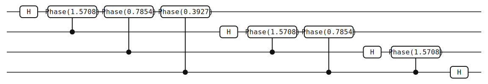
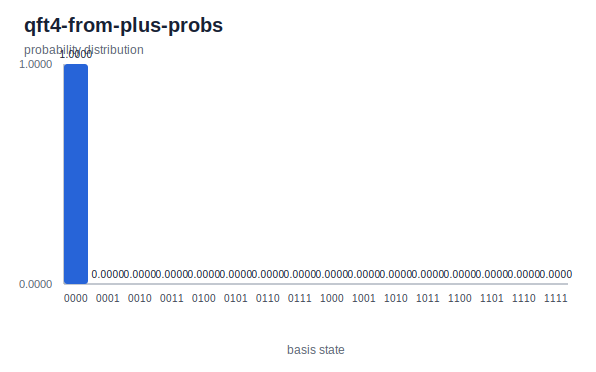

# Quantum Fourier Transform

> The quantum analogue of the discrete Fourier transform — a ladder of Hadamards and controlled phases that underlies phase estimation, Shor's algorithm, and the hidden-subgroup family.

## Background

The Quantum Fourier Transform (QFT) is the unitary that maps a computational
basis state \\( |x\rangle \\) to a Fourier-weighted superposition over basis
states. It is the quantum analogue of the discrete Fourier transform (DFT),
but its value in quantum algorithms is not as a standalone transform: it is
the *subroutine* that converts phase information into a bitstring that can be
measured. Phase estimation, Shor's factoring, the hidden-subgroup family, and
HHL all end with a QFT (or its inverse) on a register of \\( n \\) qubits.

The cost accounting is striking. A classical FFT on \\( N = 2^n \\) samples
costs \\( O(N \log N) = O(n \, 2^n) \\) arithmetic operations. The QFT acts
on the amplitude vector of a \\( 2^n \\)-dimensional state and uses
\\( O(n^2) \\) gates — exponentially smaller in \\( n \\). The catch is
readout. You cannot extract the full output vector; one measurement returns
one sample of a probability distribution over \\( 2^n \\) outcomes. The QFT
is useful as a stage *inside* a larger algorithm that funnels the answer into
a small number of heavy-weight basis states, not as a drop-in replacement for
the classical FFT.

The decomposition used here is Coppersmith's 1994 note[^coppersmith]; the
earliest quantum application is Shor's factoring algorithm[^shor94].
Nielsen and Chuang cover the construction in §5.1[^nc].

## The math

Write integers \\( x, y \in \{0, 1, \dots, 2^n - 1\} \\) and let
\\( \omega = e^{2\pi i / 2^n} \\) be a primitive \\( 2^n \\)-th root of unity.
The QFT is defined by its action on the computational basis:

$$ \operatorname{QFT}|x\rangle \;=\; \frac{1}{\sqrt{2^n}} \sum_{y=0}^{2^n - 1} \omega^{xy}\,|y\rangle. $$

Extended linearly to arbitrary states, this is a unitary — it is the DFT
matrix acting on the amplitude vector.

**Product form.** Writing \\( x = \sum_{k=0}^{n-1} x_k 2^k \\) and
\\( y = \sum_{k=0}^{n-1} y_k 2^k \\) with \\( x_k, y_k \in \{0, 1\} \\), the
exponent in the definition becomes

$$ \frac{xy}{2^n} \;=\; \sum_{k=0}^{n-1} \frac{x\, y_k 2^k}{2^n} \;=\; \sum_{k=0}^{n-1} \frac{x\, y_k}{2^{n-k}}. $$

Because \\( e^{2\pi i m} = 1 \\) for any integer \\( m \\), only the
fractional part of \\( x / 2^{n-k} \\) matters. Substituting the sum over
\\( y \\) by an independent sum over each bit \\( y_k \\) and grouping
factors produces the product form

$$ \operatorname{QFT}|x\rangle \;=\; \bigotimes_{k=0}^{n-1} \frac{|0\rangle + e^{2\pi i x / 2^{n-k}}\,|1\rangle}{\sqrt{2}}. $$

Each output qubit carries one factor; the phase on that factor depends on
\\( x \\) through a single dyadic fraction. This factorization is what makes
the circuit compile to \\( O(n^2) \\) gates instead of the \\( 2^{2n} \\)-entry
unitary you would otherwise have to synthesize.

**Circuit recipe.** Building the state bit by bit, the \\( k \\)-th factor
\\( (|0\rangle + e^{2\pi i x / 2^{n-k}}|1\rangle)/\sqrt{2} \\) expands as

$$ \frac{1}{\sqrt{2}}\Bigl(|0\rangle + e^{i \pi x_{n-k-1}} \cdot e^{i \pi x_{n-k-2}/2} \cdots e^{i \pi x_0 / 2^{n-k-1}} \,|1\rangle\Bigr). $$

A Hadamard on an input qubit produces the leading
\\( e^{i\pi x_\bullet} \\) factor. Each remaining factor is a controlled phase
rotation: if the input bit at a lower index is 1, add a phase
\\( \pi / 2^j \\) to the \\( |1\rangle \\) branch of the output qubit. Doing
this for one output qubit at a time gives the ladder seen in the circuit
below.

**Convention: omitted swaps.** The product form above places the phase for
bit \\( x_0 \\) on the *last* output qubit and the phase for bit
\\( x_{n-1} \\) on the *first*. A textbook QFT therefore ends with a layer of
SWAPs that reverses the output wires so that "qubit \\( k \\)" means the same
thing before and after the transform. The circuit below *omits* those final
SWAPs: the output register holds the QFT amplitudes with qubit indices
reversed relative to the standard convention. For input
\\( |0 \ldots 0\rangle \\) the output is the uniform superposition, which is
invariant under reversal, so the simulation on this page cannot see the
difference. Any algorithm that uses QFT as a subroutine — phase estimation
in particular — must track the reversed order, either by re-indexing qubits
in the surrounding circuit or by appending SWAPs explicitly.

## The circuit



Ten elements. The full circuit JSON follows the
[Circuit JSON Conventions](../conventions.md). The ladder structure is
direct: one output qubit per "round", with a Hadamard followed by
\\( n - k - 1 \\) controlled-`Phase` gates using higher-indexed qubits as
controls. For \\( n = 4 \\) the sequence is

1. `H` on qubit 0
2. Controlled-`Phase(π/2)`, target q0, control q1
3. Controlled-`Phase(π/4)`, target q0, control q2
4. Controlled-`Phase(π/8)`, target q0, control q3
5. `H` on qubit 1
6. Controlled-`Phase(π/2)`, target q1, control q2
7. Controlled-`Phase(π/4)`, target q1, control q3
8. `H` on qubit 2
9. Controlled-`Phase(π/2)`, target q2, control q3
10. `H` on qubit 3

The first three gates in JSON:

```json
{
  "num_qubits": 4,
  "elements": [
    {"type": "gate", "gate": "H", "targets": [0]},
    {"type": "gate", "gate": "Phase", "targets": [0], "controls": [1], "control_configs": [true], "params": [1.5707963267948966]},
    {"type": "gate", "gate": "Phase", "targets": [0], "controls": [2], "control_configs": [true], "params": [0.7853981633974483]}
  ]
}
```

The numeric parameters are \\( \pi/2 \approx 1.5707963 \\) and
\\( \pi/4 \approx 0.7853981 \\); the q0–q3 rotation further down the list
uses \\( \pi/8 \approx 0.3926990 \\). `Phase(φ)` is the diagonal gate
\\( \operatorname{diag}(1, e^{i\varphi}) \\); promoted by `controls: [j]` it
applies the rotation only when qubit \\( j \\) is in \\( |1\rangle \\). There
are no final SWAPs.

[Full QFT-4 circuit JSON](./generated/circuits/qft4.json).

> **Bit ordering callout.** In yao-rs, qubit 0 is the *most* significant bit
> of the probability-array index: `probabilities[k]` is the amplitude-squared
> of the basis state whose binary label is \\( k \\) with \\( q_0 \\) written
> first (leftmost). Because this circuit omits the reversing SWAPs, the
> *meaning* of each output wire is reflected relative to the textbook QFT;
> the index convention itself is unchanged. See
> [bit ordering](../conventions.md#bit-ordering) for the full rule.

## Running it

**Quick run** (after `cargo install --path yao-cli`):

```bash
yao example qft --nqubits 4 | yao simulate - | yao probs -
```

Expected output (every one of the 16 entries equal to \\( 1/16 = 0.0625 \\)):

```text
{
  "locs": null,
  "num_qubits": 4,
  "probabilities": [
    0.06250000000000003, 0.06250000000000003, 0.06250000000000003, 0.06250000000000003,
    0.06250000000000003, 0.06250000000000003, 0.06250000000000003, 0.06250000000000003,
    0.06250000000000003, 0.06250000000000003, 0.06250000000000003, 0.06250000000000003,
    0.06250000000000003, 0.06250000000000003, 0.06250000000000003, 0.06250000000000003
  ]
}
```

**Regenerating this page's artifacts** from the repo root:

```bash
cargo build -p yao-cli --no-default-features
target/debug/yao example qft --nqubits 4 --json --output docs/src/examples/generated/circuits/qft4.json
target/debug/yao visualize docs/src/examples/generated/circuits/qft4.json --output docs/src/examples/generated/svg/qft4.svg
target/debug/yao simulate docs/src/examples/generated/circuits/qft4.json | target/debug/yao probs - > docs/src/examples/generated/results/qft4-probs.json
python3 scripts/plot_cli_results.py docs/src/examples/generated/results docs/src/examples/generated/plots
```

## Interpreting the result


Every bar has height \\( 1/16 = 0.0625 \\). The QFT applied to
\\( |0 \ldots 0\rangle \\) is the uniform superposition

$$ \operatorname{QFT}|0\rangle^{\otimes n} \;=\; \frac{1}{\sqrt{2^n}} \sum_{y=0}^{2^n-1} |y\rangle, $$

because setting \\( x = 0 \\) kills every phase in the defining sum. This is
the same state that \\( H^{\otimes n} \\) produces from the zero state, and
indeed the QFT *is* \\( H^{\otimes n} \\) on a computational-basis input
\\( |0\ldots 0\rangle \\) — the controlled-phase gates all act on the
\\( |0\rangle \\) branch of their controls and leave every amplitude alone.
Measuring yields a uniform distribution over the 16 basis states.

A uniform distribution is the *least* informative output a QFT can produce,
and that is the point of this example: it shows the circuit running
end-to-end on a register where the simplification makes every gate's role
visible (or visibly trivial). Non-trivial outputs appear when the input is a
phase-encoded state of the form
\\( \tfrac{1}{\sqrt{2^n}}\sum_x e^{2\pi i \phi x}\,|x\rangle \\): the QFT
*collapses* that phase \\( \phi \\) onto a basis state peaked at
\\( \lfloor \phi \cdot 2^n \rfloor \\). That collapse is precisely phase
estimation — see [Phase Estimation](./phase-estimation.md).

### Verifying the phase structure

The run above does not actually *verify* the circuit: on the zero input
every QFT gate after the first Hadamard layer acts on \\( |0\rangle \\)
branches of their controls and leaves amplitudes untouched, so the same
uniform distribution would result from \\( H^{\otimes n} \\) alone. To
check that the controlled-phase ladder has the right rotation angles
— which is where the \\( O(n^2) \\) non-trivial structure lives — we
need an input that *requires* the phases to cancel. The canonical choice
is the uniform superposition \\( |+\rangle^{\otimes n} = H^{\otimes n}|0\rangle^{\otimes n} \\):

$$ \operatorname{QFT}|+\rangle^{\otimes n} \;=\; \frac{1}{2^n}\sum_y \Bigl(\sum_x e^{2\pi i xy / 2^n}\Bigr)\,|y\rangle \;=\; \frac{1}{2^n}\sum_y 2^n\,\delta_{y,0}\,|y\rangle \;=\; |0\rangle^{\otimes n}. $$

The inner sum collapses by orthogonality of \\( 2^n \\)-th roots of
unity, which is exactly the phase cancellation the controlled-phase
ladder encodes. On output, every amplitude on \\( y \neq 0 \\) is the
sum of \\( 2^n \\) unit-modulus complex numbers that must add to zero —
a sensitive, global condition that breaks if any rotation angle is
wrong.

A bundled shell workflow prepends an \\( H^{\otimes 4} \\) layer to the
canonical QFT-4 circuit and runs it from the same CLI pipeline:

```bash
YAO_ARTIFACT_DIR=docs/src/examples/generated YAO_BIN=target/debug/yao bash examples/cli/qft_from_plus.sh 4
python3 scripts/plot_cli_results.py docs/src/examples/generated/results docs/src/examples/generated/plots
```

Expected `docs/src/examples/generated/results/qft4-from-plus-probs.json`:

```text
{
  "num_qubits": 4,
  "probabilities": [1.0, 0.0, 0.0, 0.0, 0.0, 0.0, 0.0, 0.0,
                    0.0, 0.0, 0.0, 0.0, 0.0, 0.0, 0.0, 0.0]
}
```



All sixteen other bins are zero to machine precision. The full-register
spike at index 0 is the required fingerprint: \\( |+\rangle^{\otimes 4} \\)
is symmetric under qubit permutation, so the omitted-SWAP convention
does not change the result — the output is still
\\( |0\rangle^{\otimes 4} \\), identified by the qubit-0-MSB index 0.

An independent cross-check uses `scripts/reference_simulate.py` on the
generated JSON:

```bash
python3 scripts/reference_simulate.py \
    docs/src/examples/generated/circuits/qft4-from-plus.json --probs | \
    python3 -c "import json,sys; d=json.load(sys.stdin); print(d['probabilities'][0])"
```

Expected output:

```text
0.9999999999999987
```

The CLI reports `probabilities[0] = 1.0` (rounded at 15 decimals in the
JSON); the reference returns `0.9999999999999987` — the difference is
\\( 1.3 \times 10^{-15} \\), inside the drift budget for a sum of
\\( 16 \\) complex exponentials that must cancel to a single non-zero
bin. Any mis-rotated controlled-phase gate would push the peak weight
noticeably below 1 and redistribute mass onto other bins.

## Variations & next steps

- `yao example qft --nqubits 6` produces an \\( n = 6 \\) QFT; the ladder
  keeps its shape, and the gate count grows as \\( \binom{n}{2} + n = O(n^2) \\).
- The *inverse* QFT is the adjoint: reverse the element order and negate the
  `Phase` parameters. This is the block that appears in the *readout* stage
  of phase estimation.
- QFT circuits have a regular controlled-phase structure that tensor-network
  contractors exploit efficiently; see [Tensor Networks](../tensor-networks.md)
  for the export path via `circuit_to_einsum`.
- Cross-links: [Phase Estimation](./phase-estimation.md) uses QFT as its
  readout block, and [Grover Search](./grover-search.md) uses the reflection
  \\( 2|s\rangle\langle s| - I \\) whose amplitude-amplification picture
  echoes the phase-extraction idea the QFT makes precise.

## References

[^coppersmith]: D. Coppersmith, "An approximate Fourier transform useful in
    quantum factoring", IBM Research Report RC 19642 (1994);
    reprinted as arXiv:quant-ph/0201067.

[^shor94]: P. W. Shor, "Algorithms for quantum computation: discrete
    logarithms and factoring", in *Proc. 35th Annual Symposium on Foundations
    of Computer Science* (IEEE, 1994), pp. 124–134.

[^nc]: M. A. Nielsen and I. L. Chuang, *Quantum Computation and Quantum
    Information*, 10th Anniversary Edition (Cambridge University Press,
    2010), §5.1 (the quantum Fourier transform).
