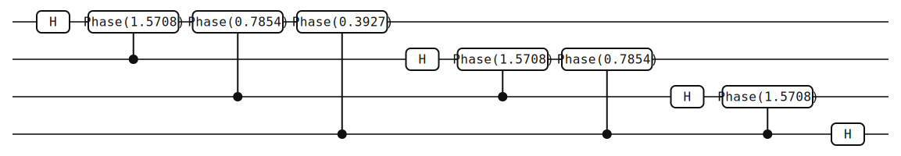

# Quantum Fourier Transform

This page walks through the QFT example found in
[`examples/qft.rs`](https://github.com/GiggleLiu/yao-rs/blob/main/examples/qft.rs),
explaining the algorithm, the circuit construction, and the expected output.

## The QFT Algorithm

The Quantum Fourier Transform maps computational basis states to the frequency
domain. For an n-qubit state |j>:

QFT|j> = (1/sqrt(2^n)) sum\_k e^(2 pi i j k / 2^n) |k>

The circuit implementation consists of:

1. For each qubit i (from 0 to n-1):
   - Apply H gate to qubit i
   - Apply controlled Phase(2 pi / 2^(j+1)) gates from qubit i+j controlling
     qubit i, for j = 1, 2, ..., n-i-1
2. Reverse qubit order with SWAP gates

## Building the Circuit

The full circuit builder function:

```rust
use std::f64::consts::PI;
use yao_rs::{Gate, Circuit, ArrayReg, put, control, apply, circuit_to_einsum};
use yao_rs::circuit::PositionedGate;

fn qft_circuit(n: usize) -> Circuit {
    let mut gates: Vec<PositionedGate> = Vec::new();

    for i in 0..n {
        gates.push(put(vec![i], Gate::H));
        for j in 1..(n - i) {
            let theta = 2.0 * PI / (1 << (j + 1)) as f64;
            gates.push(control(vec![i + j], vec![i], Gate::Phase(theta)));
        }
    }

    for i in 0..(n / 2) {
        gates.push(PositionedGate::new(
            Gate::SWAP,
            vec![i, n - 1 - i],
            vec![],
            vec![],
        ));
    }

    Circuit::new(vec![2; n], gates).unwrap()
}
```

Let's break this down step by step.

### Phase Rotations

```rust
for i in 0..n {
    gates.push(put(vec![i], Gate::H));
    for j in 1..(n - i) {
        let theta = 2.0 * PI / (1 << (j + 1)) as f64;
        gates.push(control(vec![i + j], vec![i], Gate::Phase(theta)));
    }
}
```

For n=4 qubits, this generates:

- **Qubit 0:** H, then Phase(pi/2) controlled by qubit 1, Phase(pi/4)
  controlled by qubit 2, Phase(pi/8) controlled by qubit 3
- **Qubit 1:** H, then Phase(pi/2) controlled by qubit 2, Phase(pi/4)
  controlled by qubit 3
- **Qubit 2:** H, then Phase(pi/2) controlled by qubit 3
- **Qubit 3:** H

The `put` helper places a single-qubit gate on the specified qubit, while the
`control` helper creates a controlled gate with specified control qubits,
target qubits, and the gate to apply.

### Bit Reversal

```rust
for i in 0..(n / 2) {
    gates.push(PositionedGate::new(
        Gate::SWAP, vec![i, n - 1 - i], vec![], vec![],
    ));
}
```

Swaps qubit 0 with qubit 3 and qubit 1 with qubit 2 to match the standard QFT
convention. The QFT algorithm naturally produces output in bit-reversed order,
so these SWAP gates correct the ordering.

## Running the Example

```bash
cargo run --example qft
```

The `main` function constructs a 4-qubit QFT circuit, applies it to an input
state, and prints the resulting amplitudes along with the tensor network
structure:

```rust
fn main() {
    let n = 4;
    let circuit = qft_circuit(n);
    let reg = ArrayReg::zero_state(n);
    let result = apply(&circuit, &reg);
    let tn = circuit_to_einsum(&circuit);
    // ... (prints results)
}
```

Output shows the amplitudes for both input states and the tensor network
structure (number of tensors and labels).

## Circuit Visualization

The same 4-qubit QFT circuit rendered with the built-in SVG backend:



You can generate the same diagram from the CLI with:

```bash
yao example qft --nqubits 4 > qft.json
yao visualize qft.json --output qft-4qubit.svg
```

## Expected Output

### QFT|0000>

Applying QFT to the all-zeros state produces a uniform superposition:

All 16 amplitudes = 1/sqrt(16) = 0.25

This is because QFT|0> = (1/sqrt(N)) sum\_k |k>.

### QFT|0001>

Produces amplitudes with phase progression e^(2 pi i k / 16). All amplitudes
have magnitude 1/sqrt(16), but with varying phases.

## Tensor Network Structure

For 4-qubit QFT:

- The circuit has 4 H gates + 6 controlled-Phase gates + 2 SWAP gates = 12
  gates total, yielding 12 tensors
- The controlled-Phase gates are non-diagonal (due to controls), so they
  allocate new labels
- The H and SWAP gates are also non-diagonal

The `circuit_to_einsum` function converts the circuit into an einsum-based
tensor network representation, which can be useful for understanding the
contraction structure and for alternative simulation strategies.
